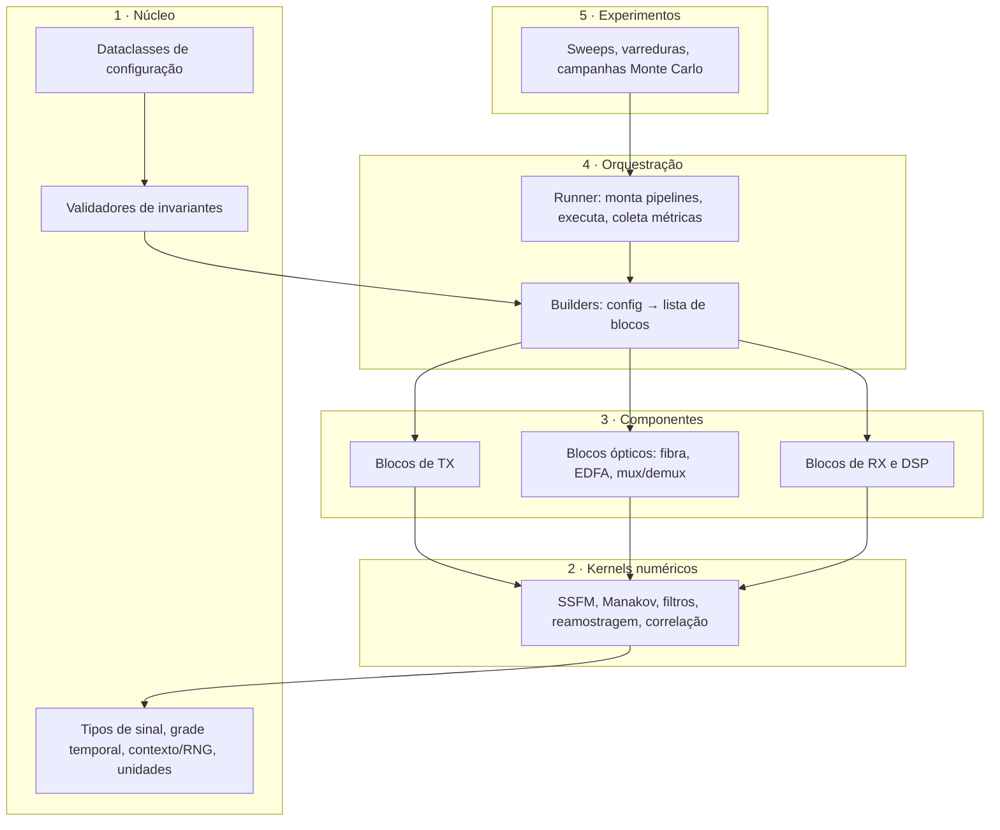
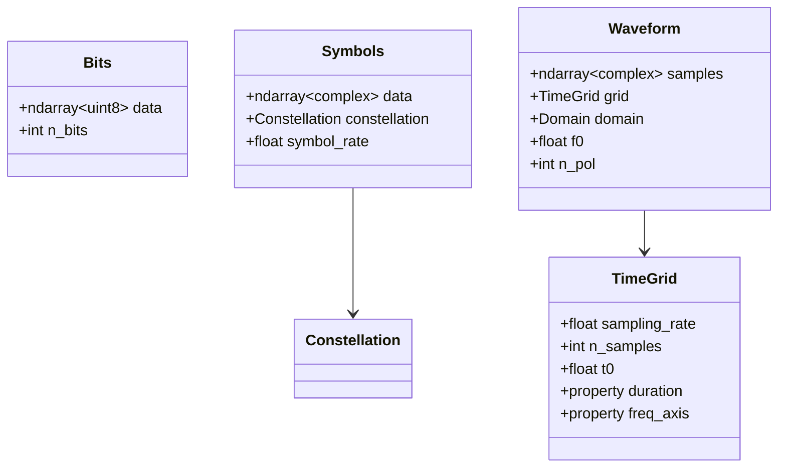
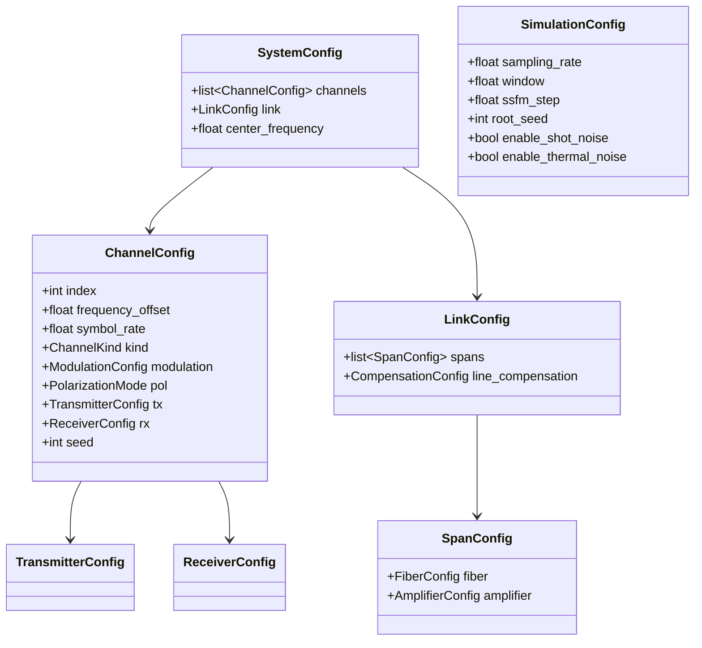
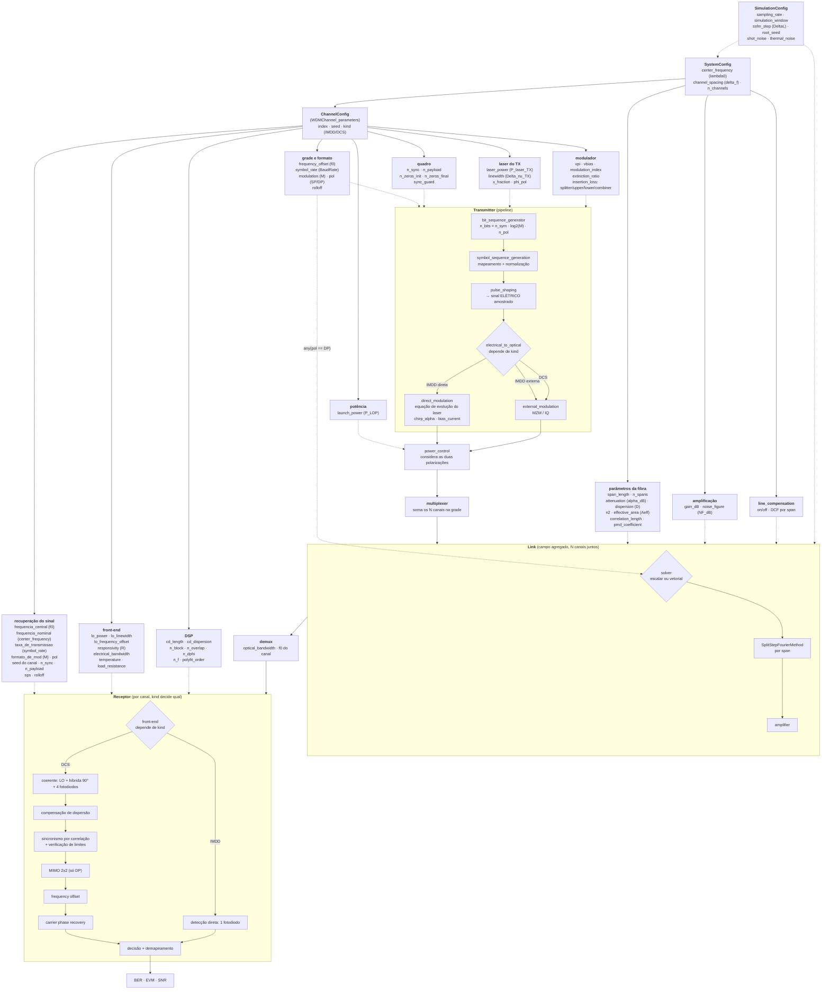
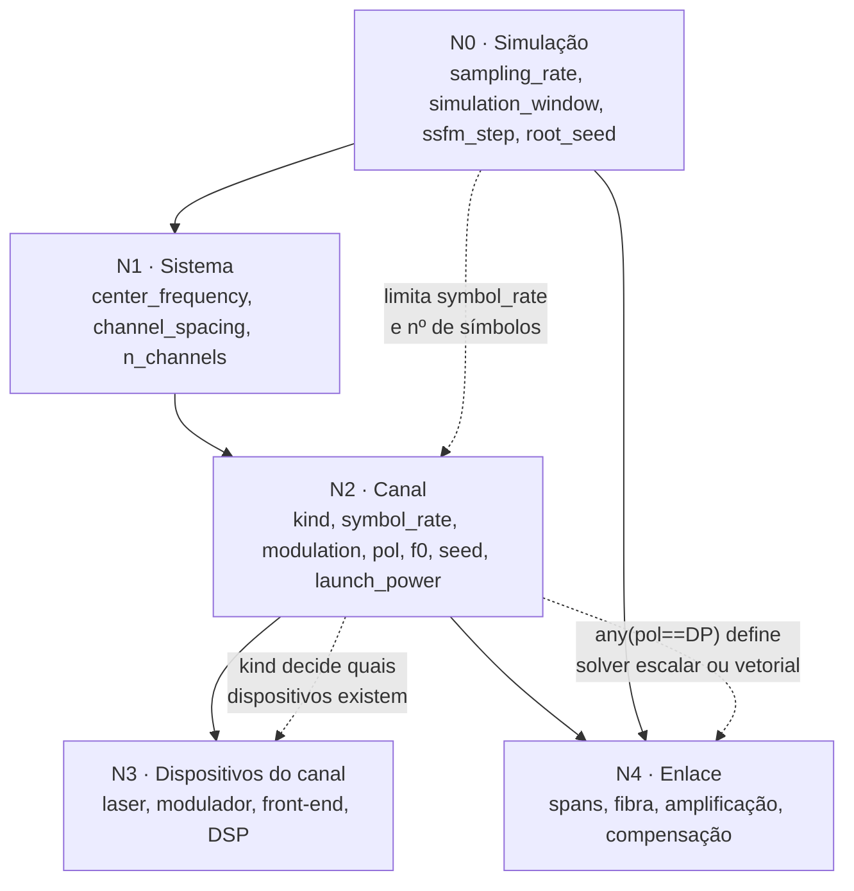
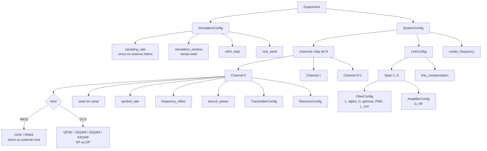
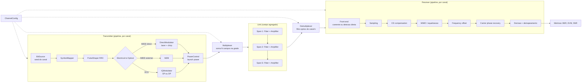
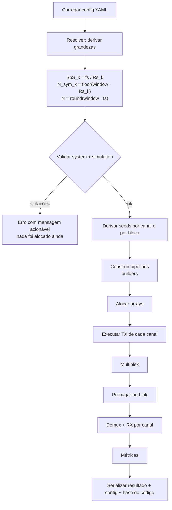
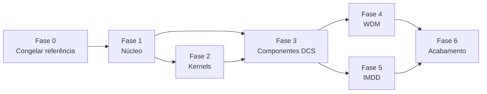

# Simulador de Sistemas de Comunicações Ópticas
## Documento de Arquitetura e Plano de Reescrita

**Versão:** 0.7
**Escopo:** reescrita e modularização do simulador atual (`6_DigitalCoherentSystem_DP_fiber_solved.ipynb` / `draft.py`) em um pacote Python testável, reprodutível e extensível para WDM, IMDD e DCS.
**Status:** proposta. As decisões marcadas com **`[D-n]`** estão em aberto e precisam ser fechadas antes da implementação. Decisões já fechadas aparecem riscadas na [seção 13](#13-decisões-em-aberto).

**Definido:** o projeto será um **pacote instalável e publicado**; **PMD de 1ª ordem entra no escopo desta versão**.

---

## Sumário

1. [Objetivo e critérios de sucesso](#1-objetivo-e-critérios-de-sucesso)
2. [Diagnóstico do código atual](#2-diagnóstico-do-código-atual)
3. [Princípios de projeto](#3-princípios-de-projeto)
4. [Modelo de domínio](#4-modelo-de-domínio)
5. [Componente ou processo: a decisão de arquitetura](#5-componente-ou-processo-a-decisão-de-arquitetura)
6. [Diagramas da arquitetura proposta](#6-diagramas-da-arquitetura-proposta)
7. [Invariantes e validação](#7-invariantes-e-validação)
8. [Reprodutibilidade e gerenciamento de aleatoriedade](#8-reprodutibilidade-e-gerenciamento-de-aleatoriedade)
9. [Catálogo de correções a implementar](#9-catálogo-de-correções-a-implementar)
10. [Limitação documentada: rotação de SoP e PMD](#10-limitação-documentada-rotação-de-sop-e-pmd)
11. [Estrutura do repositório e engenharia de software](#11-estrutura-do-repositório-e-engenharia-de-software)
12. [Plano de migração](#12-plano-de-migração)
13. [Decisões em aberto](#13-decisões-em-aberto)
14. [Validação contra referência externa (VPI)](#14-validação-contra-referência-externa-vpi-transmissionmaker)
15. [Desempenho e custo computacional](#15-desempenho-e-custo-computacional)
16. [Anexo A: contratos de referência](#anexo-a-contratos-de-referência)
17. [Anexo B: inventário de variáveis do código atual](#anexo-b-inventário-de-variáveis-do-código-atual)

---

## 1. Objetivo e critérios de sucesso

### 1.1 O que o simulador precisa fazer

| Capacidade | Estado atual | Alvo |
|---|---|---|
| Sistema coerente DP (DCS) | Funcional em parte | Suportado e testado |
| Sistema IMDD (OOK, PAM4) | Ausente | Suportado |
| WDM com N canais | Tentativa manual em uma célula | Primeira classe, N arbitrário |
| Modulação por canal independente | Ausente | Por canal: formato, baud rate, potência, seed |
| Multi-span com EDFA | Funcional | Suportado, com perfil de span configurável |
| Rotação de SoP / PMD | Incorreta / ausente | Modelo de passo grosso correto |
| Reprodutibilidade | Ausente | Determinismo bit a bit dado um seed raiz |
| Testes automatizados | Ausente | Testes unitários + testes de física |

### 1.2 Critérios de sucesso

Um critério é o que permite dizer que a reescrita terminou. Proponho cinco:

- **C1.** Uma simulação é descrita por um único objeto de configuração serializável (YAML/JSON), e rodar duas vezes o mesmo arquivo produz resultados idênticos bit a bit.
- **C2.** Cada bloco físico tem pelo menos um teste que verifica o parâmetro configurado contra o parâmetro medido na saída (ex.: configurar ER = 30 dB no MZM e medir 30 dB).
- **C3.** O SSFM é validado contra soluções conhecidas: alargamento de pulso gaussiano por dispersão pura (fórmula fechada) e sóliton fundamental (invariância de forma).
- **C4.** Um cenário WDM de N canais roda sem que nenhum parâmetro precise ser duplicado à mão, e cada canal tem sequência de bits e ruído de fase estatisticamente independentes.
- **C5.** Trocar IMDD por DCS em um canal é uma mudança de configuração, não uma mudança de código.

---

## 2. Diagnóstico do código atual

Esta seção existe para justificar tecnicamente por que a recomendação é **reescrita com o código atual como referência de física**, e não refatoração incremental. Todas as afirmações abaixo são verificáveis nos arquivos entregues.

### 2.1 Inventário

| Métrica | Valor |
|---|---|
| Linhas (`draft.py`) | 2463 |
| Células do notebook | 49 (37 de código, 12 de markdown, 12 células de código vazias) |
| Classes | 0 |
| Funções de topo | 17 nomes, 20 definições (3 nomes duplicados) |
| Variáveis globais de topo | ~66 |
| Reatribuições de `M`, `SpS`, `ts`, `BaudRate` | 7 vezes cada |
| Suporte a WDM estruturado | 0 |

### 2.2 Falhas estruturais

Estas são as que impedem refatoração incremental, porque quebram a premissa de que uma função pode ser movida para outro módulo sem mudar de comportamento.

#### F-1. Funções definidas mais de uma vez, com corpos divergentes

| Nome | Linhas em `draft.py` | Situação |
|---|---|---|
| `fiber` | 1019, 1091 | Cópias idênticas |
| `QAM_receiver_DP` | 652, 1327 | **Assinaturas diferentes** |
| `DPQAM_receiver` | 1710, 2085 | Corpos diferentes |

O Python descarta silenciosamente a primeira definição de cada par. Qual versão está ativa depende da ordem de execução das células. No notebook entregue isso já causou um erro real:

```
Célula 34 →  TypeError: QAM_receiver_DP() got an unexpected keyword argument 't'
```

A célula chamou a versão que não aceita `t`, porque a ordem de execução (`In[65]`, `In[30]`, `In[6]`) misturou estados. **Este é o modo de falha mais perigoso do arquivo**: o resultado numérico depende da ordem em que as células foram rodadas, e essa ordem não está registrada em lugar nenhum.

#### F-2. Funções que leem variáveis globais

As assinaturas não descrevem as dependências reais:

| Função | Globais lidas de dentro |
|---|---|
| `DPQAM_receiver` (viva) | `t`, `M`, `N_inf`, `SpS`, `RollOff`, `ts` |
| `DPQAM_receiver` (morta) | as acima **mais `E_TX`** — o receptor lê o sinal do transmissor |
| `DPQAM_transmitter` | `P_laser_TX` |
| `QAM_receiver_DP` (morta) | `P_array` (nunca definida → `NameError`) |

Consequência prática: `DPQAM_receiver(E_RX, ...)` não é uma função do seu argumento. Ela é uma função do estado global do interpretador. Mover esse `def` para `components/rx.py` produz `NameError` imediato em seis nomes.

#### F-3. Contrato de quadro (frame) duplicado por convenção, não por objeto

O transmissor monta o quadro como `[N_zeros_init | N_sync | N_inf | N_zeros_final]`. O receptor reconstrói os índices assim (linhas 1526–1528):

```python
ind_sync = (np.arange(N_sync) + 10) * SpS + ind_i[0][0]
ind_inf  = (np.arange(N_inf) + 10 + N_sync) * SpS + ind_i[0][0]
```

> **Correção em relação à v0.1 deste documento.** A v0.1 afirmava que o `10` deveria ser `N_zeros_init = 100` e que TX e RX tinham divergido. Isso estava errado, e a geração do draft executável mostrou o porquê: o gabarito de correlação é construído com `np.zeros(10)` de guarda própria, e `np.correlate` devolve o índice onde o **gabarito inteiro** se alinha. O `+10` compensa a guarda do gabarito, e está correto.

O defeito real é outro e é mais grave: **não existe verificação de limites sobre o pico de correlação.** Se o pico for espúrio — e com demux de janela retangular, WDM e 150 km ele é — `ind_inf` ultrapassa o fim do buffer. O `10` continua sendo número mágico duplicado implicitamente entre o gabarito e a aritmética de índices, mas é code smell, não a causa.

Há ainda um defeito ao lado: `ind_MIMO` e `ind_inf` começam **no mesmo ponto**, `(10+N_sync)*SpS`. O quadro do transmissor nunca insere o bloco MIMO (`s_MIMO_i` é calculado e nunca concatenado), então os índices de treino apontam para dentro do payload. Ambos são vestigiais.

Resultado registrado no notebook:

```
Célula 22 → IndexError: index 269440 is out of bounds for axis 1 with size 269440
Célula 39 → IndexError: index 269449 is out of bounds for axis 1 with size 269440
```

em `s_inf = s[:, ind_inf]`. O tamanho 269440 confere com `(100 + 256 + 16384 + 100) × 16`. As duas falhas ocorreram no bloco WDM de 4 canais, exatamente onde o pico espúrio é mais provável.

#### F-4. Reseeding global do RNG dentro de TX e RX

```python
np.random.seed(sync_seed)          # QAM_transmitter, linha 337
...
s_b = np.random.randint(0, 2, N_bits_total)   # payload sai do mesmo stream
```

e novamente dentro do receptor (linha ~1509), para regenerar a sequência de sincronismo.

Três consequências:

1. A seed de sincronismo determina também os bits de payload. São conceitos distintos amarrados a um número só.
2. Cada chamada ao TX ou ao RX **reinicia o gerador global**, o que reinicia os streams de ruído do laser, do EDFA e da rotação de SoP. Em uma varredura de spans, os pontos da curva não são realizações independentes.
3. O RX conhece a sequência de sincronismo por *convenção de seed*, não por dado recebido. É acoplamento oculto entre dois módulos que deveriam se comunicar por interface explícita.

#### F-5. Instrumentação costurada na física

`plot_flag` é propagado por praticamente toda a cadeia, e há chamadas a `plt.figure()` dentro de `fiber`, `photodiode`, transmissor e receptor. Visualização é uma preocupação transversal; misturada ao cálculo, ela impede rodar em lote, em paralelo, ou em servidor sem display.

**Solução adotada, em duas etapas.** A decisão de *como* plotar fica para depois; o que precisa ser resolvido agora é *que dados guardar*, porque os testes de cenário vão precisar deles. Etapa 1, já implementada no draft executável: os blocos gravam os arrays que seriam plotados num dicionário `RECORD` e o resultado é exportado em `.npz` junto com a configuração em `.json`. Nenhum bloco importa matplotlib. Etapa 2, na biblioteca: o mesmo mecanismo vira o `Probe` da seção 5.5, que embrulha qualquer bloco e grava sua saída sem que o bloco saiba. A plotagem passa a ser um consumidor do `.npz`, escrita quando e como convier.

#### F-6. Mutação do argumento

`QAM_receiver_DP` executa `s[0,:] = s_f_x` sobre o array recebido. Uma função de processamento reescreve a entrada do chamador.

#### F-7. Dependências de API obsoletas

- `np.complex_` em três lugares (linhas 1085, 1157, 1190). **Removido no NumPy 2.0.** Verificado: no NumPy 2.4.4 o atributo não existe, então o código não roda em ambiente atual sem alteração.
- `numpy.matlib` está depreciado; `ml.repmat` é substituível por broadcasting, com ganho de desempenho.
- `%matplotlib qt` na primeira célula, incompatível com execução headless.

#### F-8. Erros latentes

- `optical_filter` faz `ind1[0][-1]`; se a borda do filtro cair fora do eixo de frequências, `ind1[0]` é vazio e o acesso levanta `IndexError`.
- Célula 20 do notebook define `delta_f` e os offsets dos 4 canais, mas nenhuma célula desse bloco terminou de rodar sem erro.

### 2.3 Falhas de física e numéricas

Estas mudam o resultado numérico e precisam de decisão consciente na reescrita, não de porte direto.

| ID | Local | Problema | Efeito |
|---|---|---|---|
| P-1 | `EDFA`, l.1185 | ASE gerado com `np.random.rand` (uniforme em [0,1)) e escala `sqrt(P_ASE)/2` | Ruído com **média não nula** (offset DC) e variância ≈ `P_ASE/48` em vez de `P_ASE/2` por quadratura. A OSNR simulada não corresponde à configurada. |
| P-2 | script, `P_aux` | `mean(abs(E_TX[0])**2) + mean(abs(E_TX[0])**2)` soma a polarização X duas vezes em vez de X+Y | Ganho do EDFA e potência de lançamento errados em até 3 dB |
| P-3 | `photodiode` | `np.random.randn(1,N)` faz a saída ter shape `(1,N)` com ruído ligado e `(N,)` com ruído desligado | O shape do retorno depende de uma flag booleana. Pior: o bug é **estrutural**, porque `DPQAM_receiver` faz `m,n = np.shape(s_Y_I)` e depende do shape `(1,N)`. Consequência: **`thermal_noise=False` quebra o receptor DP** |
| P-13 | `DPQAM_receiver` | Aceita `sync_seed_X` e `sync_seed_Y` mas passa os literais `0` e `123` adiante ao `QAM_receiver_DP` | Os parâmetros da própria função são ignorados |
| P-14 | `DPQAM_receiver` | Fotodiodos da polarização X usam `R=0.9` fixo e `BW`; os de Y usam `R` e `BW/2` | As duas polarizações são detectadas com front-ends diferentes sem que nada declare isso |
| P-4 | `photodiode` | Shot noise usa `2q·mean(|i_pd|)`, um valor único para todo o bloco | Perde a dependência instantânea com o sinal. Relevante para IMDD, onde o shot noise é dominante nos níveis altos |
| P-5 | `fiber` | Termo não linear usa `γ·(|Ax|²+|Ay|²)` | Para propagação com duas polarizações a equação de Manakov exige o fator **8/9**. Sem ele, os efeitos não lineares são superestimados em ~12,5% |
| P-6 | `fiber` | Split-step assimétrico (passo linear inteiro + passo não linear inteiro), passo fixo, sem controle de erro | Erro local O(ΔL²) em vez de O(ΔL³). Nenhum critério para escolher ΔL |
| P-7 | `fiber` | Rotação de SoP sorteada a cada passo ΔL, com 2 ângulos em vez de 3 | Ver [seção 10](#10-limitação-documentada-rotação-de-sop-e-pmd) |
| P-8 | `optical_filter` | Máscara retangular no domínio da frequência | Resposta ao impulso do tipo sinc → *ringing* de Gibbs e ISI adicionada pelo próprio demux |
| P-9 | `QAM_transmitter` | `s_inf = s_inf / np.max(np.real(s_inf))` | Normalização pelo máximo **realizado** nos dados, não pelo máximo da constelação. A potência do sinal varia entre execuções conforme os símbolos sorteados |
| P-10 | `QAM_mod` | Laço Python símbolo a símbolo com cadeia de `if` por formato | O(N) em Python puro; e cada formato novo exige um novo bloco `if` |
| P-11 | `DAC_Nyquist` | Interpolação circular por FFT no bloco inteiro, com janela raised-cosine aplicada ao espectro replicado | Assume periodicidade do bloco e `SpS` inteiro. Não é um filtro reutilizável e não permite RRC + filtro casado |
| P-15 | `photodiode` | Filtro elíptico com `gpass=3` aplicado com `lfilter`. A **ordem depende de `fs`**, logo de `SpS`, e a fase não linear introduz ISI. O código só funciona porque `BW = 80 GHz` está quase 6× acima da taxa de símbolo | **Muito alto.** Trocar `SpS` de 16 para 4 muda a BER em 3 ordens de grandeza. Ver seção 15.3 |
| P-16 | `DPQAM_receiver` | `BW = 4*20e9` é literal, não derivado da taxa de símbolo do canal | Um receptor coerente real tem banda de 1,0 a 1,5 × R_s |
| P-12 | vários | Vetor de frequência montado à mão (`np.arange(Nt)/(Nt/fs)-fs/2`) | Correto só para `Nt` par. `np.fft.fftfreq` resolve e documenta a convenção |

### 2.4 O que a tentativa de WDM da célula 20 revela

A célula 20 já monta 4 canais em grade de 75 GHz e soma os campos:

```python
Freq_offset_TX0 = -3*delta_f/2   # ... TX1, TX2, TX3
t, E_TX_0, ... = DPQAM_transmitter(..., sync_seed_X=0, sync_seed_Y=123, Freq_offset=Freq_offset_TX0, ...)
t, E_TX_1, ... = DPQAM_transmitter(..., sync_seed_X=0, sync_seed_Y=123, Freq_offset=Freq_offset_TX1, ...)
...
E_TX = E_TX_0 + E_TX_1 + E_TX_2 + E_TX_3
```

Três problemas que a arquitetura nova precisa eliminar por construção:

- **Os 4 canais carregam exatamente a mesma sequência de bits e o mesmo ruído de fase.** Todos usam `sync_seed_X=0, sync_seed_Y=123`, e por causa de **F-4** a seed determina o payload e reinicia o RNG do laser. Os canais interferentes são cópias deslocadas em frequência do canal sob teste, perfeitamente correlacionadas com ele. Qualquer estudo de XPM ou de diafonia não linear feito assim é inválido. É exatamente por isso que o requisito **"cada canal tem uma seed"** precisa ser estrutural.
- **O multiplexador é uma soma solta**, sem normalização de potência e sem registro da grade de frequências. A potência total de lançamento cresce com N sem que ninguém declare isso.
- **A taxa de amostragem é escolhida por canal, não pelo sistema.** Com `SpS = 16` e `BaudRate = 56 GBd`, `fs = 896 GSa/s`. A grade ocupa ±146 GHz, ou seja, `fs` mínima ≈ 292 GHz. O simulador roda com **3,07× mais amostras do que o necessário**. Com `SpS` fixo por canal, esse desperdício cresce com o número de canais.

Isso confirma a regra que você já definiu: **existe uma única `sampling_rate` no sistema inteiro**, e `SpS` de cada canal passa a ser uma grandeza *derivada*, `SpS_k = fs / Rs_k`.

---

## 3. Princípios de projeto

Sete princípios, cada um respondendo a uma falha concreta da seção 2.

| # | Princípio | Responde a |
|---|---|---|
| PR-1 | **Configuração explícita e serializável.** Nenhum bloco lê estado global. Tudo que um bloco precisa chega por construtor ou por argumento. | F-2 |
| PR-2 | **Separar o *quê* do *como*.** `SystemConfig` descreve o sistema físico; `SimulationConfig` descreve o método numérico (fs, janela, ΔL, tolerâncias, seeds). | F-4, P-6 |
| PR-3 | **Validar antes de alocar.** Invariantes (Nyquist, grade de frequências, potência) são checados na construção, antes de qualquer array grande existir. | 2.4 |
| PR-4 | **Aleatoriedade injetada, nunca global.** Todo bloco estocástico recebe um `numpy.random.Generator` derivado deterministicamente de uma seed raiz. | F-4 |
| PR-5 | **Instrumentação por fora.** Blocos não plotam e não imprimem. Observação é feita por *probes* que registram sinais. | F-5 |
| PR-6 | **Kernel numérico separado do componente.** `Fiber` é um objeto de configuração fina; `ssfm_manakov(...)` é uma função pura em `kernels/`. | P-5, P-6, testabilidade |
| PR-7 | **Contratos por objeto, não por convenção.** Layout de quadro, grade WDM e sequências piloto são objetos compartilhados entre TX e RX. | F-3 |

---

## 4. Modelo de domínio

### 4.1 Camadas



Regra de dependência: **uma camada só depende das camadas abaixo dela.** `kernels/` não importa `components/`; `components/` não importa `pipelines/`. Isso é verificável automaticamente com `import-linter` no CI.

### 4.2 Tipos de sinal

Sua nota inicial propunha uma classe `Signal` com um campo `type`. Recomendo **não** fazer isso: um discriminador de tipo vira `if type == ...` espalhado por toda parte, e é o mesmo antipadrão que já aparece em `QAM_mod` (P-10). Você mesmo já apontou a direção certa em `class 2`: "múltiplas representações numéricas do mesmo sinal → sinais diferentes para diferentes representações".

Proponho três tipos, mais um envelope:



Pontos de projeto:

- **`Waveform` é sempre `(P, N)` complexo**, com `P = 1` ou `2`. Isso evita os `if` de shape que hoje aparecem no `photodiode` (P-3). Um sinal elétrico real é armazenado como complexo com parte imaginária nula, ou como `P=1` com `domain=ELECTRICAL`. **`[D-5]`**
- **`f0` é o offset em relação ao centro da banda de simulação**, não a frequência absoluta. É assim que a célula 20 já funciona na prática (`Freq_offset_TXk`), e é o que permite simular a grade WDM inteira em banda base equivalente com um único campo.
- **`TimeGrid` é compartilhado, não recriado.** Hoje cada função reconstrói `t` e `f` do zero, com convenções ligeiramente diferentes (`t[1]-t[0]` em umas, `t[2]-t[1]` no `photodiode`). Um objeto só elimina a classe inteira de bugs.
- Quatérnios e fibração de Hopf: úteis como *parametrização* da rotação de SoP (seção 10), não como formato de armazenamento. O campo continua sendo Jones complexo 2×N.


#### 4.2.1 Sobre a proposta de uma classe `Signal` única

A proposta original é uma classe `Signal` com campos `type` e `pol`, guardando todas as representações, com `sizeof()` e `constellation()`. Vale separar o que nela está certo do que gera problema, porque as duas coisas costumam ser confundidas.

**O que está certo e deve ser preservado.**

O `sizeof()` é a intuição mais valiosa da proposta. As dimensões das representações não são independentes:

```
n_bits    = n_symbols · log2(M) · n_pol
n_samples = n_symbols · SpS
n_symbols = floor(simulation_window · symbol_rate)
```

Isso é uma relação única e merece um objeto único. Hoje ela está espalhada por `N_inf`, `N_bits_total`, `N_sym`, `N_samples`, recalculada em cada função com `int(...)` e `len(...)`, e é a origem direta dos dois `IndexError` da seção 2.2.

Também está certo que o sinal carregue sua própria proveniência. O receptor precisa saber quais bits foram transmitidos para calcular BER, e hoje isso é resolvido **regenerando a sequência a partir da seed** — o que é legítimo, desde que a seed não seja global.

**Onde a proposta gera problema.**

Há dois tipos de "mudança" sendo tratados como se fossem o mesmo:

| Mudança | Natureza | Quem faz |
|---|---|---|
| bits ↔ símbolos ↔ amostras | **Representação.** Invertível, determinística, sem dispositivo e sem física | A própria estrutura de dados |
| elétrico → óptico | **Processo físico.** Irreversível, com ruído, dependente do dispositivo (MZM, laser, chirp, ER, Vπ) | Um componente |

Se a classe `Signal` tem um método que converte elétrico em óptico, ela precisa conhecer o modulador, o laser, o Vπ e o ponto de polarização. O modulador migra para dentro do tipo de dado, e aí a classe `Signal` vira o lugar onde toda a física de transmissão acaba morando.

**Síntese proposta.**

Preservar a ideia de "um objeto que conhece todas as dimensões", separar o que é processo físico, e admitir o campo `type` como metadado:

```python
@dataclass(frozen=True)
class SignalGeometry:
    """O sizeof() da proposta original, promovido a objeto de primeira classe."""
    n_symbols: int
    bits_per_symbol: int
    samples_per_symbol: float
    n_pol: int

    @property
    def n_bits(self) -> int:     return self.n_symbols * self.bits_per_symbol * self.n_pol
    @property
    def n_samples(self) -> int:  return round(self.n_symbols * self.samples_per_symbol)
```

```python
@dataclass(frozen=True)
class Waveform:
    samples: np.ndarray          # (n_pol, n_samples)
    grid: TimeGrid
    domain: Domain               # ELECTRICAL | OPTICAL  <- o "type" da proposta, mantido
    geometry: SignalGeometry
    f0: float = 0.0
    channel_id: int | None = None
```

**A regra que evita o antipadrão** não é "proibir o campo `type`". É:

> O campo `domain` pode ser usado para **verificar pré-condições** (um fotodiodo recusa entrada elétrica) e para **escolher visualização**. Nunca para escolher física dentro de uma mesma função.

Ou seja, isto é bom e desejável:

```python
def __call__(self, x: Waveform, ctx) -> Waveform:
    require(x.domain is Domain.OPTICAL, "fotodiodo espera entrada óptica")
```

e isto é o que precisa ser evitado:

```python
def process(sig):
    if sig.type == 'electrical':   ...
    elif sig.type == 'optical':    ...      # duas físicas diferentes numa função só
```

`Bits` e `Symbols` continuam tipos separados, porque seus arrays têm dtype e comprimento diferentes de `Waveform`, e porque a assinatura `SymbolMapper: Bits -> Symbols` é o que documenta o pipeline. Mas os três compartilham a mesma `SignalGeometry`, que é o vínculo que a proposta original queria criar.

`constellation()` sai da classe e vira função em `plotting/`, por PR-5 (instrumentação fora da física). Isso não perde nada: `plot_constellation(symbols)` é tão conveniente quanto `symbols.constellation()`, e mantém `core/` sem dependência de matplotlib — o que importa num pacote publicado.

**`[D-13]`** Confirmar esta síntese, ou manter a classe única com `type` e aceitar as pré-condições dentro dela?

### 4.3 Configuração: `System` vs `Simulation`

Esta é a separação que faz `RequiresNyquistSatisfied` ser possível.



`ChannelConfig` é exatamente o seu `WDMChannel_parameters`: um objeto só, consumido por TX, pelo Link (via mux) e pelo RX, como no seu segundo diagrama.

**`SamplingRate` e `SimulationWindow` saem de `System` e vão para `Simulation`.** No seu primeiro diagrama eles penduram em `System`, mas conceitualmente são escolhas de método numérico, não propriedades do sistema físico: a mesma rede WDM pode ser simulada com fs diferentes. Colocá-los em `SimulationConfig` é o que permite escrever `validate(system, simulation)` como função pura e rodá-la antes de alocar memória.


#### 4.3.1 Diagrama completo de parâmetros (revisão do segundo diagrama, com todas as variáveis)

Mesma topologia do diagrama enviado, agora com os nomes reais levantados no código. Linha cheia é fluxo de sinal; linha tracejada é parâmetro alimentando um bloco.



**Sobre o vínculo `frequencia_central` / `frequencia_nominal`.** No diagrama original os dois apareciam separados sem relação explícita. São coisas distintas e ambas necessárias: `center_frequency` é a frequência absoluta do centro da banda de simulação (nível N1, uma só para o sistema inteiro), e `f0` é o deslocamento do canal em relação a ela (nível N2, um por canal). A frequência absoluta do canal é `center_frequency + f0`, e é ela que deveria alimentar a compensação de dispersão do receptor — hoje o código usa `1550e-9` fixo para todos os canais.

### 4.4 Canal e Enlace

Você já apontou que são coisas distintas. Formalizando:

| Conceito | Responsabilidade | Sabe sobre |
|---|---|---|
| **Channel** | Um canal WDM lógico: gera bits, modula, e do outro lado recupera. Contém TX e RX. | Só de si mesmo: seu `f0`, seu formato, sua seed |
| **Multiplexer** | Combina os N campos ópticos em um campo agregado | A grade de frequências inteira |
| **Link** | O meio físico compartilhado: sequência de spans (fibra + amplificador) e compensação de linha | Só do campo agregado. Não sabe quantos canais existem |
| **Demultiplexer** | Seleciona um canal do campo agregado | A grade de frequências inteira |

O `Link` propaga o **campo total**, o que é a modelagem correta: XPM e FWM emergem da propagação conjunta, não precisam ser modelados explicitamente. Essa é uma propriedade importante de ter no documento porque é fácil alguém "otimizar" isso depois propagando canal a canal e destruir a física.

**SP vs DP.** Você confirmou que são dois eixos ortogonais. A questão em aberto é se SP deve ser NLSE escalar de verdade (com γ) ou Manakov com a polarização Y zerada (com 8/9·γ) — são equações diferentes e dão resultados diferentes. **`[D-2]`**


#### 4.4.1 Por que `LinkConfig` e `ChannelConfig` são separados

A pergunta é justa, e o diagrama original de fato desenha `WDMChannel_parameters --> all_fiber_parameters` e `--> line_compensation`, o que sugere que o enlace deriva do canal.

O motivo da separação é físico antes de ser de software: **existe uma fibra e ela carrega todos os canais ao mesmo tempo.** Se o enlace fosse propriedade do canal, quatro canais teriam quatro `span_length`, quatro `alpha_dB`, quatro `D`. Duas consequências:

1. **Ou os quatro valores são obrigados a ser iguais**, e aí você recriou a duplicação que o `lambda0` em 17 lugares já demonstrou ser fonte de divergência silenciosa.
2. **Ou eles podem divergir**, e aí a configuração descreve um sistema que não existe: quatro fibras diferentes ocupando o mesmo espaço.

Há também a consequência computacional: o SSFM roda **uma vez** sobre o campo agregado. É exatamente isso que faz XPM e FWM emergirem sozinhos, sem serem modelados explicitamente. Se cada canal tivesse seu enlace, a tentação natural seria propagar canal a canal, e aí a diafonia não linear desaparece do simulador sem que ninguém perceba.

**Mas a intuição por trás da pergunta está certa em um ponto específico.** Algumas decisões do enlace não são dele, são consequência do conjunto de canais:

| Decisão do enlace | De onde realmente vem |
|---|---|
| Solver escalar ou vetorial | `any(ch.pol is DP for ch in channels)` |
| Banda de simulação necessária | grade de `f0_k` e `symbol_rate_k` de todos os canais |
| Se compensação de linha faz sentido | `kind` dos canais (DCS normalmente sem) |
| Potência total lançada na fibra | soma de `launch_power_k` |

Isso é uma relação de **derivação**, não de propriedade. Em código:

```python
def resolve_link_mode(channels: list[ChannelConfig]) -> LinkMode:
    """O enlace não escolhe SP/DP. Ele descobre a partir dos canais."""
    return LinkMode.VECTOR if any(c.pol is Pol.DP for c in channels) else LinkMode.SCALAR
```

Ou seja: `LinkConfig` guarda o que é genuinamente do meio físico (fibra, spans, amplificadores, compensação), e um resolvedor lê os canais para decidir os modos de operação. A seta do seu diagrama existe, mas aponta para o resolvedor, não para a posse dos parâmetros.

Fica em aberto `[D-14]`: se um canal SP pode coexistir com um DP, o campo agregado é sempre 2×N e o canal SP ocupa uma polarização com a outra em zero.

### 4.5 Configuração em cascata

Esta seção responde diretamente ao ponto "existem diferentes configurações do sistema para cada componente, e uma configuração deve bloquear outras".

#### 4.5.1 Os cinco níveis

O código atual tem 66 globais e até 21 parâmetros por função, todos no mesmo plano. O levantamento completo está no [Anexo B](#anexo-b-inventário-de-variáveis-do-código-atual). Organizados em cascata, eles caem em cinco níveis, e cada nível só pode ser decidido depois do anterior:



O nível 4 é o que a arquitetura precisa tratar com cuidado: **o enlace é compartilhado, mas duas de suas decisões vêm dos canais.** O solver escalar ou vetorial não é escolha do enlace, é consequência de `any(ch.pol is DP for ch in channels)`. As anotações de aula dizem "dentro do link tem q definir se é SP e DP", e isso está certo do ponto de vista do solver, mas a *fonte* da decisão são os canais. **`[D-14]`**: um canal SP pode coexistir com um canal DP no mesmo enlace? Se sim, o campo agregado é 2×N e o canal SP ocupa uma polarização com a outra em zero.

#### 4.5.2 Grandezas livres e grandezas derivadas

O problema central da configuração atual não é a quantidade de parâmetros, é que **parâmetros dependentes estão expostos como livres**. O caso mais claro:

```
BaudRate = 14e9          # global
Tsym     = 1/BaudRate    # global, derivada
ts       = Tsym/SpS      # global, derivada
SpS      = 16            # global
```

O conjunto `{BaudRate, SpS, ts, fs}` tem **um** grau de liberdade além do baud rate, mas cinco funções recebem `SpS` **e** `ts` como parâmetros independentes: `QAM_transmitter`, `QAM_receiver`, `QAM_receiver_DP` (as duas cópias) e `DPQAM_transmitter`. Nada verifica que `ts · SpS == 1/BaudRate`. Passar um par inconsistente produz um resultado numérico plausível e errado, sem nenhum aviso. Pior: `BaudRate` nunca é passado a função nenhuma — ele existe apenas implicitamente no produto `ts · SpS`.

Com uma única `sampling_rate` global, o conjunto livre correto é:

| Livre | Nível | Derivada | Fórmula |
|---|---|---|---|
| `sampling_rate` | N0 | `time_step` | `1/fs` |
| `simulation_window` | N0 | `n_samples` | `round(window · fs)` |
| `symbol_rate_k` | N2 | `samples_per_symbol_k` | `fs / Rs_k` |
| | | `n_symbols_k` | `floor(window · Rs_k)` — truncado |
| `modulation_k` | N2 | `bits_per_symbol` | `log2(M)` |
| `pol_k` | N2 | `n_pol` | 1 ou 2 |
| | | `n_bits_k` | `n_symbols_k · log2(M) · n_pol` |
| `channel_spacing`, `n_channels` | N1 | `f0_k` | grade centrada |
| `span_length`, `alpha` | N4 | `gain_dB` (se ganho = perda) | `alpha_dB · L_span` |
| `n2`, `Aeff`, `lambda0` | N4 | `gamma` | `2π·n2/(λ·Aeff)` |
| `D`, `lambda0` | N4 | `beta2` | `−D·λ²/(2πc)` |

Tudo na coluna "derivada" deixa de ser configurável. O `resolve()` calcula, registra no resultado e nunca aceita como entrada. Isso elimina por construção toda uma classe de bugs que hoje só apareceria como um número estranho no fim de uma simulação de dez minutos.

#### 4.5.3 Duplicações a eliminar

O levantamento encontrou quantidades físicas únicas escritas em vários lugares:

| Quantidade | Ocorrências em `draft.py` | Risco |
|---|---|---|
| `lambda0 = 1550e-9` | **17 vezes**, incluindo *hardcoded* dentro de `QAM_receiver_DP` (l.1472) | A compensação de dispersão do receptor assume 1550 nm independentemente da frequência real do canal. Num sistema WDM isso deixa de ser aproximação inofensiva |
| `c = 3e8` | 4 vezes, e com valor arredondado | Erro de 0,07 % em β₂. Sobre 300 km de compensação de CD vira erro de fase mensurável. `scipy.constants.c` resolve |
| `L`, `D` | Globais, parâmetros de `fiber`, de `DPQAM_receiver` e de `QAM_receiver_DP` | O RX conhece a verdade do enlace por duplicação, não por interface |
| `sync_seed_X`, `sync_seed_Y` | TX e RX | Ver seção 8 |
| `BW` | Usado **ao mesmo tempo** como banda óptica do filtro de demux (`optical_filter`) e como banda elétrica do fotodiodo (`photodiode`) | São grandezas fisicamente distintas com o mesmo nome. E as duas cópias de `DPQAM_receiver` discordam entre si: uma passa `BW` ao fotodiodo, a outra passa `BW/2` |

Na arquitetura nova, cada uma dessas quantidades tem um dono único: `lambda0` e `c` em `core/units.py` e `SystemConfig.center_frequency`; `L` e `D` em `FiberConfig`, e o RX recebe um `CompensationConfig` **próprio** que pode ou não coincidir com a verdade — ver `[D-7]`. A banda do demux e a banda do fotodiodo viram `DemuxConfig.optical_bandwidth` e `PhotodiodeConfig.electrical_bandwidth`.

### 4.6 Bloqueio de configurações

"Uma configuração deve bloquear outras" é um requisito de projeto, não um detalhe de implementação. Proponho atacá-lo em dois níveis complementares.

#### 4.6.1 Nível 1: tornar o estado inválido irrepresentável

O mecanismo mais forte não é validar combinações proibidas, é fazer com que elas não possam ser escritas. Isso se consegue com **uniões discriminadas**: em vez de um `ChannelConfig` com todos os campos e um `kind` que diz quais valem, existem tipos distintos, e o campo simplesmente não existe onde não faz sentido.

```python
@dataclass(frozen=True)
class IMDDChannel:
    kind: Literal["imdd"] = "imdd"
    modulation: OOK | PAM4                    # QPSK/QAM nem são escrevíveis aqui
    frontend: DirectModulation | ExternalModulation
    # pol não existe: IMDD é SP por construção   <- [D-15]

@dataclass(frozen=True)
class CoherentChannel:
    kind: Literal["dcs"] = "dcs"
    modulation: QPSK | QAM
    pol: PolarizationMode                     # SP | DP
    lo: LaserConfig                           # só o coerente tem oscilador local

ChannelConfig = IMDDChannel | CoherentChannel
```

```python
@dataclass(frozen=True)
class DirectModulation:
    scheme: Literal["direct"] = "direct"
    laser: RateEquationLaserConfig            # equação de evolução do laser
    chirp_alpha: float

@dataclass(frozen=True)
class ExternalModulation:
    scheme: Literal["external"] = "external"
    laser: CWLaserConfig
    mzm: MZMConfig                            # Vpi, Vbias, ER, IL
```

Escrever `Vpi` num canal de modulação direta deixa de ser um erro de configuração detectado em tempo de execução, e passa a ser um erro de tipo detectado pelo `mypy` e pelo validador de esquema antes de qualquer coisa rodar. **É o bloqueio mais barato e mais confiável que existe.**

Como o projeto vai ser publicado e instalável, recomendo **pydantic v2** para o pacote `config/`: uniões discriminadas por `Field(discriminator="kind")` são nativas, e sai de graça a exportação de JSON Schema, o que dá validação de YAML com mensagem de erro decente para quem instalar o pacote. `core/`, `kernels/` e `components/` continuam com `dataclasses` puros, sem depender de pydantic.

#### 4.6.2 Nível 2: tabela declarativa de dependências

O nível 1 é garantia de tipo, mas não descreve a cascata para um ser humano, nem serve para dirigir um assistente de configuração ou gerar documentação. Para isso, uma tabela declarativa derivada dos diagramas e das anotações de aula:

| Decisão | Valor | Libera | Bloqueia | Padrão sugerido |
|---|---|---|---|---|
| `channel.kind` | `IMDD` | `modulation ∈ {OOK, PAM4}`; `frontend ∈ {direct, external}`; RX de detecção direta | `QPSK`, `QAM`; oscilador local; recuperação de fase; MIMO 2×2 | — |
| `channel.kind` | `DCS` | `modulation ∈ {QPSK, 16QAM, 32QAM, 64QAM}`; `pol ∈ {SP, DP}`; RX coerente com LO | `OOK`, `PAM4`; modulação direta | `line_compensation = False` (aviso se `True`) |
| `frontend.scheme` | `direct` | equação de taxa do laser, corrente de bias, `chirp_alpha` | `Vpi`, `Vbias`, ILs, ER do MZM | — |
| `frontend.scheme` | `external` | `MZMConfig` completo | parâmetros de modulação direta | — |
| `channel.pol` | `SP` | — | segunda seed de polarização, MIMO 2×2 | — |
| `channel.pol` | `DP` | MIMO 2×2, birrefringência e PMD, seed de polarização Y | — | — |
| `any(pol == DP)` | verdadeiro | solver **vetorial** (Manakov) no enlace, campo agregado 2×N | solver escalar | — |
| `todos pol == SP` | verdadeiro | solver **escalar** (NLSE) | rotação de SoP, DGD | — |
| `link.line_compensation` | `True` | `DCFConfig` por span | — | — |
| `simulation.sampling_rate` | fixado | — | `symbol_rate_k` acima do limite de Nyquist da grade | — |
| `simulation.window` | fixado | — | `n_symbols_k` maior que `floor(window · Rs_k)` | — |
| `birefringence.pmd_coefficient` | `> 0` | `correlation_length`, número de seções | — | `L_corr = 100 m` |

A tabela vive em um módulo `config/cascade.py`, é a fonte para `docs/`, e cada linha vira um teste: configurar o valor bloqueado deve produzir uma `ConfigError` com mensagem nomeando a decisão que causou o bloqueio.

#### 4.6.3 Mensagem de erro como parte do contrato

Bloqueio sem explicação é pior que ausência de bloqueio, porque o usuário não sabe qual decisão anterior causou o problema. O padrão para todas as mensagens:

```
ConfigError [cascade]
  Canal 2: 'mzm.vpi' não se aplica.
  Causa: 'channel.kind = IMDD' com 'frontend.scheme = direct'.
  A modulação direta não usa Mach-Zehnder.
  Se você quer um MZM neste canal, mude frontend.scheme para 'external'.
```

Três elementos obrigatórios: o campo recusado, **a decisão anterior que o bloqueou**, e a ação que resolveria.

---

## 5. Componente ou processo: a decisão de arquitetura

Esta foi a dúvida explícita. Resposta curta: **não são alternativas. Componente é a unidade de configuração e estado; processo é a interface que o componente expõe.**

### 5.1 Por que não "só funções"

Um dispositivo real tem parâmetros que persistem entre chamadas (Vπ, ER, NF, responsividade) e às vezes estado interno (stream de RNG, taps de um equalizador adaptativo, memória de filtro IIR). Modelar isso como função pura leva a assinaturas com vinte argumentos posicionais — que é literalmente o que o código atual faz:

```python
def DPQAM_transmitter(M=16, SpS=16, RollOff=0.2, ts=1e-9, sync_seed_X=0, sync_seed_Y=123,
                      N_MIMO=128, N_sync=128, N_inf=4096, N_zeros_init=10, N_zeros_final=10,
                      Delta_nu=0, Freq_offset=0, ind_mod=0.1, Splitter_IL=1.0, Upper_IL=2.0,
                      Lower_IL=2.0, Combiner_IL=1.1, Vpi=2.5, Vbias=2.5, plot_flag=False):
```

Vinte argumentos, e ainda assim a função lê `P_laser_TX` do escopo global. A assinatura já não cabe e já não é honesta.

### 5.2 Por que não "motor de dataflow"

A alternativa oposta é construir um motor com portas, tipos de porta, buffers e escalonador, no estilo Simulink / GNU Radio / OptiSystem. **Não recomendo.** Esse motor custa meses de trabalho e só se paga em cenários de streaming ou tempo real. Aqui a simulação é offline, em lote, com a janela inteira na memória. O "escalonador" pode ser o próprio Python percorrendo uma lista.

### 5.3 O padrão recomendado

**Componente = substantivo.** `Laser`, `MachZehnder`, `Fiber`, `EDFA`, `Photodiode`, `CDCompensator`. Um objeto de configuração validada, opcionalmente com estado.

**Processo = verbo, e é o `__call__` do componente.** Uma interface única permite compor pipelines.

```python
from typing import Protocol

class Block(Protocol):
    """Todo estágio da cadeia implementa esta interface."""
    def __call__(self, x: Signal, ctx: SimContext) -> Signal: ...
```

```python
@dataclass(frozen=True)
class MachZehnder:
    vpi: float
    vbias: float
    extinction_ratio_db: float
    insertion_loss_db: float

    def __post_init__(self):
        if self.vpi <= 0:
            raise ConfigError("Vpi deve ser positivo")

    def __call__(self, x: Waveform, ctx: SimContext) -> Waveform:
        ...   # sem globais, sem plot, sem seed global
```

Quando um bloco precisa de aleatoriedade, ela vem do contexto, nunca do módulo:

```python
@dataclass(frozen=True)
class EDFA:
    gain_db: float
    noise_figure_db: float

    def __call__(self, x: Waveform, ctx: SimContext) -> Waveform:
        rng = ctx.rng_for(self, x.channel_id)   # determinístico, ver seção 8
        ...
```

Blocos que são matemática pura (pulse shaping, compensação de dispersão) continuam sendo funções, embrulhadas num dataclass fino para entrarem no mesmo pipeline. Não há custo de desempenho relevante: o `__call__` acontece uma vez por bloco por simulação, e o trabalho pesado está dentro do NumPy.

### 5.4 O que esse padrão compra

| Ganho | Como |
|---|---|
| **Testabilidade** | Cada bloco isolado: configurar ER = 30 dB, medir 30 dB na saída |
| **Reprodutibilidade** | `ctx` carrega o RNG derivado da seed do canal, resolvendo F-4 |
| **IMDD vs DCS sem `if`** | Deixa de ser condicional dentro do modulador e passa a ser *qual lista de blocos o builder monta*. Sua ideia de "cascade variable" vira `build_tx(channel_cfg) -> list[Block]` |
| **Instrumentação removível** | `plot_flag` some. Um `Recorder` embrulha qualquer bloco e guarda a saída |
| **Paralelização** | Blocos sem estado global são seguros em `multiprocessing`; varreduras de potência e distância paralelizam sem trabalho extra |

### 5.5 Probes: substituindo `plot_flag`

```python
@dataclass
class Probe:
    inner: Block
    label: str
    store: dict

    def __call__(self, x, ctx):
        y = self.inner(x, ctx)
        self.store[self.label] = y.copy()
        return y
```

Um pipeline instrumentado é o mesmo pipeline com alguns blocos embrulhados. A física nunca sabe que está sendo observada. Plot vira uma função separada que consome `store`.

---

## 6. Diagramas da arquitetura proposta

### 6.1 Hierarquia de configuração (revisão do primeiro diagrama)

Mudanças em relação ao original: `SamplingRate` e `SimulationWindow` migram para `Simulation`; WDM deixa de ser booleano e vira `len(channels)`; a seed passa a ser propriedade explícita do canal.



### 6.2 Cadeia de processamento (revisão do segundo diagrama)

O original misturava as setas de configuração com as setas de fluxo de sinal, o que dificultava ver onde estava cada condicional. Aqui elas estão separadas: linha cheia é sinal, linha tracejada é configuração.



**Onde ficam as condicionais que o diagrama original deixava implícitas:**

| Condicional | Onde é resolvida | Como |
|---|---|---|
| IMDD vs DCS | `build_tx` / `build_rx` | Escolhe quais blocos entram na lista |
| Direct vs external modulation | `build_tx`, dentro do ramo IMDD | Escolhe entre `DirectModulator` e `MZM` |
| SP vs DP | `build_tx` e o kernel da fibra | Define `n_pol` do `Waveform` e qual equação o SSFM resolve |
| Compensação de linha ligada/desligada | `build_link` | Insere ou não o bloco no span |

Nenhuma delas vira `if` dentro de um bloco. Todas viram escolha de composição no builder.

### 6.3 Fluxo de execução



O ponto importante é a ordem: **validar antes de alocar.** Hoje um erro de configuração só aparece depois de minutos de SSFM.

---

## 7. Invariantes e validação

`RequiresNyquistSatisfied` é o principal, mas não o único. Proponho um módulo `validation/` com validadores independentes que retornam uma lista de violações, em vez de levantar exceção no primeiro problema — assim o usuário vê todos os erros de configuração de uma vez.

### 7.1 `RequiresNyquistSatisfied`

Com uma única `fs` no sistema inteiro, a banda ocupada pela grade WDM tem que caber na banda de simulação:

```
para cada canal k:
    B_k = Rs_k · (1 + rolloff_k)              # banda ocupada do canal
    borda_k = |f0_k| + B_k / 2

banda_ocupada = max_k(borda_k)

REQUER:  fs / 2  ≥  banda_ocupada · margem_de_alargamento
```

A `margem_de_alargamento` cobre o alargamento espectral por SPM/XPM na fibra, que não é conhecido a priori. **`[D-6]`**: adotar um valor padrão conservador (1,2 a 1,5) configurável, ou estimar a partir de `γ·P·L_eff`?

Violações separadas, com mensagens distintas:

| Validador | Verifica |
|---|---|
| `NyquistSatisfied` | A regra acima |
| `ChannelsDoNotOverlap` | Espaçamento da grade ≥ banda ocupada dos vizinhos |
| `IntegerSamplesPerSymbol` | `fs / Rs_k` inteiro para todo k — ver **`[D-4]`** |
| `WindowFitsAtLeastOneFrame` | `window · Rs_k ≥ N_sync_k + N_min_payload` |
| `SSFMStepResolvesNonlinearity` | `ΔL ≪ L_NL = 1/(γ·P)` e `ΔL ≪ L_D` |
| `AmplifiersCompensateSpanLoss` | Ganho vs perda por span, avisa sobre desequilíbrio acumulado |
| `FFTSizeIsEfficient` | `N` altamente composto; avisa se cair em um primo grande |

### 7.2 Grandezas derivadas

A configuração declara o mínimo; o resolver calcula o resto e registra tudo no resultado:

| Derivada | Fórmula | Observação |
|---|---|---|
| `N` | `round(window · fs)` | Ajustar para o próximo tamanho 5-smooth, e recalcular `window` |
| `SpS_k` | `fs / Rs_k` | Não é mais parâmetro de entrada |
| `N_sym_k` | `floor(window · Rs_k)` | **Truncar**, conforme você definiu |
| `Δf` | `fs / N` | Resolução espectral |
| `L_NL`, `L_D` | `1/(γP)`, `T0²/|β2|` | Usados pelo validador do passo do SSFM |

---

## 8. Reprodutibilidade e gerenciamento de aleatoriedade

`np.random.seed` global (F-4) precisa desaparecer por completo. A substituição é `SeedSequence` com `spawn_key`, que dá streams independentes e reproduzíveis sem estado compartilhado:

```python
@dataclass(frozen=True)
class SimContext:
    grid: TimeGrid
    root_seed: int

    def rng_for(self, *keys: int | str) -> np.random.Generator:
        """Stream determinístico e independente para (canal, bloco, papel)."""
        h = tuple(k if isinstance(k, int) else _stable_hash(k) for k in keys)
        return np.random.default_rng(np.random.SeedSequence(self.root_seed, spawn_key=h))
```

Uso:

```python
rng_bits  = ctx.rng_for(channel.index, "payload")
rng_sync  = ctx.rng_for(channel.index, "sync")
rng_laser = ctx.rng_for(channel.index, "tx_laser_phase")
rng_ase   = ctx.rng_for(span_index, "edfa_ase")
rng_sop   = ctx.rng_for("link", "sop")
```

Propriedades garantidas:

- Streams independentes entre canais. Resolve diretamente o problema dos 4 canais idênticos da seção 2.4.
- **Payload e sincronismo desacoplados.** Hoje uma seed só controla os dois.
- Mudar o número de canais não muda a realização de ruído dos canais existentes, porque a chave é o índice do canal e não a ordem de chamada.
- Uma varredura Monte Carlo usa `root_seed` diferente por repetição, e os pontos são genuinamente independentes.

**Sequência de sincronismo e de payload.** Correção de posição em relação à v0.1 deste documento: **regenerar a sequência no receptor a partir da seed do canal é legítimo e deve ser mantido** — é o que as anotações de aula descrevem ("recebe o seed do canal pra poder regenerar o sinal e calcular a BER"), e é prática padrão. O que estava errado no código atual não é a regeneração, é o `np.random.seed` **global**: ele acopla payload, sincronismo e ruído no mesmo stream.

Com `ctx.rng_for(channel.index, "payload")`, o receptor reproduz exatamente os mesmos bits de forma determinística e sem tocar em estado compartilhado. Payload e sincronismo passam a ter streams distintos, e o ruído do laser e do EDFA fica isolado de ambos.

O que ainda precisa ser objeto compartilhado, e não convenção, é o **layout do quadro** — a origem de F-3:

```python
@dataclass(frozen=True)
class FrameLayout:
    n_zeros_init: int
    n_sync: int
    n_payload: int
    n_zeros_final: int
    sync_sequence: np.ndarray      # o dado, não a receita para regerá-lo

    @property
    def total_symbols(self) -> int: ...
    def payload_slice(self, offset: int, sps: int) -> slice: ...   # com verificação de limites
```

Os índices passam a sair de um método único, usado pelos dois lados. O `+10` mágico deixa de existir.

---

## 9. Catálogo de correções a implementar

Ordenadas por impacto no resultado numérico. As colunas *Impacto* e *Prioridade* servem para negociar o escopo da primeira versão.

| ID | Correção | Impacto no resultado | Prioridade |
|---|---|---|---|
| **C-1** | Seeds independentes por canal e por papel (payload, sync, laser, ASE, SoP) | **Alto.** Sem isso qualquer estudo WDM é inválido | Bloqueante |
| **C-2** | ASE gaussiano circular: `sqrt(P_ASE/2)·(randn + j·randn)` em vez de `rand` | **Alto.** Corrige OSNR e remove offset DC | Bloqueante |
| **C-3** | Verificação de limites no pico de correlação (`SyncError` com mensagem) + `FrameLayout` compartilhado para eliminar o número mágico de guarda | **Alto.** Corrige os dois `IndexError` registrados | Bloqueante |
| **C-4** | Uma definição por função; remover cópias divergentes | **Alto.** Elimina dependência da ordem de execução | Bloqueante |
| **C-5** | Potência de lançamento somando X **e** Y | Médio, até 3 dB | Alta |
| **C-6** | Fator 8/9 de Manakov na propagação DP | Médio, ~12,5% no termo não linear | Alta — depende de **`[D-3]`** |
| **C-7** | Rotação de SoP Haar-uniforme, desacoplada de ΔL, com comprimento de correlação, **mais DGD de 1ª ordem** (`[D-8]` fechada) | Médio a alto em DP | Alta — ver seção 10 |
| **C-8** | Split-step simétrico (meio passo linear / passo não linear / meio passo linear) | Médio. Erro O(ΔL³) em vez de O(ΔL²), permite ΔL maior pelo mesmo erro | Alta |
| **C-9** | Shot noise dependente do sinal instantâneo | Médio em IMDD, baixo em coerente | Média |
| **C-10** | Normalização da constelação por potência teórica, não pelo máximo realizado | Baixo mas remove variância espúria entre execuções | Média |
| **C-11** | Filtro óptico com resposta suave (super-gaussiana ou Butterworth) em vez de janela retangular | Médio no demux WDM | Média |
| **C-12** | Pulse shaping por RRC no TX + filtro casado no RX, substituindo `DAC_Nyquist` | Médio. Habilita `SpS` não inteiro e sobreposição de quadros | Média — depende de **`[D-4]`** |
| **C-13** | Saída do fotodiodo com shape consistente, independente das flags de ruído | Nenhum se corrigido; hoje é fonte de bug silencioso | Alta |
| **C-14** | `np.complex_` → `np.complex128`; remover `numpy.matlib` | Nenhum. Sem isso não roda em NumPy ≥ 2.0 | Bloqueante |
| **C-15** | `np.fft.fftfreq` em vez de eixo de frequência montado à mão | Baixo, corrige o caso de `N` ímpar | Baixa |
| **C-16** | `QAM_mod`/`QAM_dem` vetorizados, com constelação como tabela e mapeamento Gray explícito | Nenhum no resultado, grande em desempenho e extensibilidade | Alta |
| **C-17** | Blocos sem `plot_flag`; instrumentação por `Probe` | Nenhum | Alta |
| **C-18** | Blocos não mutam os argumentos | Nenhum se corrigido; hoje é bug latente | Alta |
| **C-19** | ER do MZM como parâmetro de primeira classe, com desequilíbrio de braços derivado dele | Nenhum hoje (ER é consequência implícita dos ILs), mas é requisito do seu diagrama | Média |
| **C-20** | Multiplexador com normalização de potência declarada e registro da grade | Médio: hoje a potência total cresce com N sem ninguém declarar | Alta |
| **C-21** | Filtro do fotodiodo com fase linear na banda do sinal (FIR, Bessel ou `filtfilt`), e `gpass` de 0,5 dB em vez de 3 dB | **Muito alto.** É o que hoje faz a BER depender de `SpS` | Bloqueante |
| **C-22** | Banda elétrica do receptor derivada de `k · symbol_rate` em vez do literal 80 GHz | Alto. Remove o acoplamento acidental entre banda e sobreamostragem | Alta |
| **C-24** | Adicionar `MMAEqualizer` e `GramSchmidtOrthogonalizer` a `components/rx/` — ausentes no rascunho e presentes na cadeia de DSP da referência | Alto: é o que produz o penhasco de baixa potência dos dados do VPI | Alta |
| **C-23** | Correlação de sincronismo por FFT, `QAM_mod`/`QAM_dem` vetorizados, recuperação de fase por broadcasting | Nenhum no resultado; 100× a 1000× em tempo | Alta |

---

## 10. Limitação documentada: rotação de SoP e PMD

### 10.1 O código atual

```python
if SoP_rotation:
    theta_rand = np.random.rand(1) * np.pi
    phi_rand   = np.random.rand(1) * 2 * np.pi
    Ax_aux = Ax * np.exp( 1j*phi_rand/2)
    Ay_aux = Ay * np.exp(-1j*phi_rand/2)
    Ax =  np.cos(theta_rand)*Ax_aux + np.sin(theta_rand)*Ay_aux
    Ay = -np.sin(theta_rand)*Ax_aux + np.cos(theta_rand)*Ay_aux
```

### 10.2 Diagnóstico

A matriz aplicada é `R(θ) · diag(e^{jφ/2}, e^{-jφ/2})`, ou seja, **dois ângulos**. SU(2) tem **três** graus de liberdade. Na esfera de Poincaré, `diag(...)` é rotação em torno do eixo S1 e `R(θ)` é rotação em torno de S3.

Medição feita aplicando o bloco acima e calculando os parâmetros de Stokes na saída, 200 000 realizações, entrada linear em X, isto é, S = (1, 0, 0):

| Rotações acumuladas | Fração com S3 > 0 | min/max de S3 | Histograma de S1 (10 bins) |
|---|---|---|---|
| 1 | 0,23 (o restante é exatamente zero) | −0,00 / +0,00 | fortemente bimodal nos polos |
| 2 | 0,50 | −1,00 / +1,00 | ainda não uniforme |
| 3 | 0,50 | −1,00 / +1,00 | quase uniforme |
| 10 | 0,50 | −1,00 / +1,00 | uniforme |

**Com uma única rotação a partir de um estado linear em X, S3 é identicamente zero.** A explicação: o estado de entrada está *sobre* o eixo S1, então a primeira rotação (em torno de S1) não faz nada, e a segunda mantém o estado no plano S3 = 0. O campo fica preso no círculo dos estados lineares e nunca alcança os polos circulares. É a formulação precisa do "só está em um hemisfério".

### 10.3 O problema maior, que o defeito acima esconde

O código sorteia ângulos novos **a cada passo ΔL do SSFM**. Com ΔL = 1 km e span de 40 km são 40 sorteios, e a distribuição acumulada converge para uniforme (linha de 10 rotações na tabela). O defeito de 2 ângulos fica mascarado.

Mas isso cria um problema pior: **a dinâmica de polarização passa a ser função do passo numérico.** Trocar ΔL de 1 km para 100 m multiplica por 10 a taxa de despolarização. Física dependendo de discretização é o tipo de acoplamento que invalida qualquer estudo de convergência do SSFM: refinar o passo para melhorar a precisão numérica muda o cenário físico simulado.

Além disso, **não há DGD nenhum**. Isso não é PMD, é rotação unitária sem atraso diferencial de grupo, e portanto não produz nenhuma penalidade dependente de frequência.

### 10.4 Solução proposta

**Parte 1 — sorteio Haar-uniforme de SU(2), com os três ângulos:**

```python
def random_su2(rng: np.random.Generator) -> np.ndarray:
    """Matriz de Jones unitária uniformemente distribuída em SU(2) (medida de Haar)."""
    alpha, beta = rng.uniform(0.0, 2*np.pi, 2)
    theta = np.arcsin(np.sqrt(rng.random()))     # sin^2(theta) ~ U(0,1)
    c, s = np.cos(theta), np.sin(theta)
    return np.array([[ c*np.exp(1j*alpha),  s*np.exp(1j*beta)],
                     [-s*np.exp(-1j*beta),  c*np.exp(-1j*alpha)]])
```

A distribuição uniforme em `sin²θ` é o que diferencia a medida de Haar de um sorteio ingênuo uniforme em θ. Aqui, aliás, é onde a fibração de Hopf e os quatérnios aparecem naturalmente: um quatérnio unitário sorteado uniformemente em S³ é exatamente um elemento de SU(2), e a projeção de Hopf S³ → S² dá o estado de polarização. É uma parametrização alternativa equivalente, útil se vocês quiserem interpolar rotações suavemente no futuro.

**Parte 2 — desacoplar do passo numérico (modelo de passo grosso):**

A fibra é dividida em seções de comprimento igual ao **comprimento de correlação** `L_corr`, que é um parâmetro físico (tipicamente de dezenas a centenas de metros), independente do ΔL do integrador. A matriz aleatória é aplicada uma vez por seção.

```python
@dataclass(frozen=True)
class BirefringenceModel:
    correlation_length: float          # L_corr, em metros
    pmd_coefficient: float = 0.0       # D_PMD em s/sqrt(m); 0 desativa DGD

    def n_sections(self, span_length: float) -> int:
        return max(1, int(round(span_length / self.correlation_length)))

    def dgd_per_section(self, span_length: float) -> float:
        """Δτ por seção, calibrado para DGD total ~ D_PMD·sqrt(L)."""
        n = self.n_sections(span_length)
        return self.pmd_coefficient * np.sqrt(span_length) * np.sqrt(np.pi / (2*n))
```

Cada seção aplica, no domínio da frequência, um elemento de DGD seguido da rotação unitária:

```
U_seção(ω) = U_random · diag( e^{-jωΔτ/2},  e^{+jωΔτ/2} )
```

Com `pmd_coefficient = 0` o modelo degenera na rotação unitária pura, que é o comportamento atual corrigido — útil para reproduzir resultados antigos. **Com `[D-8]` fechada, `pmd_coefficient > 0` é o caso de uso principal e entra já na Fase 3.** Valor padrão fechado pela [seção 14.13](#1413-bifrost-como-referência-de-pmd): **0,05 ps/√km**, coerente com a especificação Corning de < 0,06 ps/√km e com os 0,040 ps/√km simulados pelo BIFROST para fibra spun. ~~`[D-17]`~~

**Parte 3 — RNG do contexto.** `rng = ctx.rng_for("link", span_index, "sop")`, nunca `np.random.rand`.

### 10.5 Consequência para os resultados existentes

Resultados de DP gerados com o código atual não são reprodutíveis com o código novo, por três motivos independentes: o sorteio muda, a taxa de rotação deixa de depender de ΔL, e o RNG deixa de ser global. Isso precisa ser dito explicitamente em qualquer comparação, e é o motivo pelo qual o plano de migração (seção 12) começa por congelar o comportamento atual em arquivos de referência antes de mexer em qualquer coisa.

---

## 11. Estrutura do repositório e engenharia de software

### 11.1 Layout

```
optsim/                              # pacote instalável
├── core/
│   ├── signals.py                   # Bits, Symbols, Waveform
│   ├── grid.py                      # TimeGrid, eixos de tempo e frequência
│   ├── context.py                   # SimContext, derivação de RNG
│   ├── constellation.py             # tabelas de constelação, mapeamento Gray
│   ├── frame.py                     # FrameLayout
│   └── units.py                     # dB/linear, dBm/W, conversões nomeadas
├── config/
│   ├── system.py                    # SystemConfig, ChannelConfig, LinkConfig, SpanConfig
│   ├── simulation.py                # SimulationConfig
│   ├── resolve.py                   # grandezas derivadas (SpS_k, N, N_sym_k)
│   └── io.py                        # carregar/salvar YAML, versionamento de esquema
├── validation/
│   ├── base.py                      # Violation, Validator, agregação
│   ├── nyquist.py                   # RequiresNyquistSatisfied
│   ├── grid.py                      # sobreposição de canais, eficiência de FFT
│   └── numerics.py                  # passo do SSFM vs L_NL e L_D
├── kernels/                         # NumPy puro, sem classes, sem estado
│   ├── ssfm.py                      # split-step simétrico, escalar e Manakov
│   ├── birefringence.py             # random_su2, modelo de passo grosso, DGD
│   ├── filters.py                   # RRC, super-gaussiana, Butterworth, filtro casado
│   ├── resample.py                  # reamostragem racional/fracionária
│   └── dsp.py                       # correlação, CMA, FOE, recuperação de fase
├── components/
│   ├── base.py                      # Protocol Block, Probe
│   ├── tx/                          # BitSource, SymbolMapper, PulseShaper,
│   │                                #   Laser, MZM, IQModulator, DirectModulator, PowerControl
│   ├── optical/                     # Fiber, Amplifier, Multiplexer, Demultiplexer, OpticalFilter
│   └── rx/                          # CoherentFrontEnd, DirectDetectionFrontEnd,
│                                    #   Photodiode, ADC, CDCompensator, MIMO, FOE, CPR, Decision
├── pipelines/
│   ├── transmitter.py               # build_tx(channel_cfg) -> list[Block]
│   ├── receiver.py                  # build_rx(channel_cfg) -> list[Block]
│   ├── link.py                      # build_link(link_cfg) -> list[Block]
│   └── runner.py                    # orquestração ponta a ponta
├── metrics/
│   ├── ber.py                       # BER contada e estimada por EVM
│   ├── evm.py
│   └── optical.py                   # OSNR, potência, espectro
├── plotting/                        # consome Probe.store; nunca importado por components/
│   ├── constellation.py
│   ├── spectrum.py
│   └── eye.py
└── cli.py                           # optsim run config.yaml -o resultados/

tests/
├── unit/                            # um teste por bloco
├── physics/                         # validações contra solução analítica
├── regression/                      # comparação com golden files
└── data/golden/                     # referências congeladas do código antigo

examples/
├── dcs_dp_16qam_single_channel.yaml
├── wdm_4ch_75ghz.yaml
└── imdd_pam4_ook.yaml

docs/
├── architecture.md                  # este documento
├── physics.md                       # equações implementadas e suas aproximações
├── limitations.md                   # limitações conhecidas (inclui seção 10)
└── migration.md                     # mapa função antiga → bloco novo
```

### 11.2 Ferramental

| Item | Escolha sugerida | Por quê |
|---|---|---|
| Empacotamento | `pyproject.toml`, PEP 621, `hatchling` ou `setuptools` | `pip install -e .` resolve os imports de uma vez |
| Ambiente | `uv` ou `conda` com lockfile | Reprodutibilidade depende de versões fixas |
| Formatação e lint | `ruff` (formata e lint em uma ferramenta) | Elimina discussão de estilo |
| Tipagem | `mypy` ou `pyright` em modo estrito nos módulos `core/` e `config/` | Onde os contratos importam mais |
| Testes | `pytest` + `pytest-cov` | Padrão |
| Arquitetura | `import-linter` | Faz cumprir a regra de camadas da seção 4.1 |
| Docs | `mkdocs-material` + `mkdocstrings` | Docstrings viram documentação |
| CI | GitHub Actions: lint, tipos, testes, camadas | Impede regressão silenciosa |
| Números aleatórios | `numpy.random.Generator` | `np.random.seed` proibido por lint |

Uma regra de lint que vale a pena adicionar explicitamente: proibir `np.random.seed`, `np.random.rand`, `np.random.randn` e `plt.` dentro de `optsim/components/` e `optsim/kernels/`. Isso transforma dois dos princípios de projeto em erro de CI em vez de acordo de cavalheiros.

### 11.3 Estratégia de testes

| Camada | O que testar | Exemplo |
|---|---|---|
| **Unidade** | Parâmetro configurado = parâmetro medido | Configurar ER = 30 dB no MZM, medir a razão entre nível alto e baixo |
| **Unidade** | Invariantes de conservação | Mux + demux ideal devolve o campo original dentro de tolerância |
| **Física** | Contra solução analítica | Pulso gaussiano com γ = 0: largura na saída bate com `T0·sqrt(1+(L/L_D)²)` |
| **Física** | Contra solução analítica | Sóliton fundamental: forma invariante após um período de sóliton |
| **Física** | Contra teoria | AWGN puro: BER medida bate com a curva teórica de M-QAM em função de Es/N0 |
| **Física** | Estatística | 10⁵ amostras da rotação de SoP: uniformidade na esfera de Poincaré (teste de Kolmogorov–Smirnov nos marginais de Stokes) |
| **Regressão** | Golden files | BER vs span do cenário de referência, com tolerância declarada |
| **Propriedade** | Determinismo | Mesma config + mesma seed ⇒ arrays idênticos bit a bit |

O teste de AWGN vs curva teórica é o mais valioso do conjunto: valida modulação, pulse shaping, filtro casado, sincronismo e demapeamento de uma vez só, contra uma referência que não depende de nenhuma escolha do projeto.

### 11.4 Requisitos específicos de um pacote publicado

Com `[D-11]` e `[D-12]` fechadas, valem também:

| Item | Decisão sugerida | Observação |
|---|---|---|
| Licença | MIT ou BSD-3 | Permissiva favorece adoção acadêmica. **Atenção:** importar BIFROST (GPL-3.0) em tempo de execução obrigaria o pacote inteiro a ser GPL-3.0. Ver 14.13 |
| Versionamento | SemVer, começando em `0.x` | Enquanto em `0.x` a API pode quebrar entre versões menores. Só vá para `1.0` quando as assinaturas de `core/` estiverem estáveis |
| Distribuição | PyPI, wheel pura | Sem extensões compiladas na v1, a wheel é universal |
| Citação | `CITATION.cff` no repositório + DOI via Zenodo | Um DOI por release permite que artigos citem a versão exata usada |
| Changelog | `CHANGELOG.md`, formato Keep a Changelog | Publicado significa que outros dependem de você; mudanças silenciosas quebram trabalhos alheios |
| API pública | `__all__` explícito em `optsim/__init__.py` | O que não está lá é interno e pode mudar sem aviso |
| Reprodutibilidade de artigo | Gravar no resultado: versão do pacote, hash do commit, versões de NumPy e SciPy, e a config completa | É o que permite reproduzir uma figura publicada dois anos depois |
| Documentação | `mkdocs` publicado no GitHub Pages, com os exemplos de `examples/` executados no CI | Exemplo que não roda no CI apodrece |
| Depreciação | `DeprecationWarning` por pelo menos uma versão menor antes de remover | Padrão do ecossistema científico |

Duas consequências de projeto que valem ser antecipadas agora, porque são caras de mudar depois:

- **O nome do pacote entra em todos os imports.** Decidir antes da Fase 1. **`[D-16]`**
- **A fronteira entre API pública e interna precisa existir desde o começo.** Se `kernels/ssfm.py` for público, o formato de seus argumentos vira contrato. Recomendo manter `kernels/` como interno na v1 e expor apenas `config/`, `core/` e o runner.

---

## 12. Plano de migração

### Fase 0 — Congelar a referência

Objetivo: ter um número contra o qual comparar. Sem isso, qualquer divergência posterior é indistinguível de bug novo.

**Revisada na v0.4.** A ideia original era congelar o código legado como golden file. Isso foi abandonado: a seção 15.3 mostra que no código legado a BER muda três ordens de grandeza ao trocar `SpS`, que é um parâmetro numérico. Uma implementação com essa propriedade não serve de gabarito.

A Fase 0 passa a ser **montar o pacote de referência externa**, conforme a [seção 14](#14-validação-contra-referência-externa-vpi-transmissionmaker):

1. Definir com o grupo os cenários REF-1 a REF-6 e exportá-los do VPI TransmissionMaker.
2. Acertar as convenções de banda base com REF-1 (propagação linear pura, sem ruído, sem DSP).
3. Escrever o carregador dos dados do VPI e os comparadores V1 a V5, com as tolerâncias da seção 14.2.
4. `draft_fixed.py` continua útil como banco de ensaio e como referência de código da física, mas deixa de ser alvo.

> Nota: o objetivo desta fase é comparabilidade, não correção. Os bugs de física (P-1, P-2, P-5) continuam presentes de propósito.

### Fase 1 — Núcleo

`core/`, `config/`, `validation/`. Nenhuma física ainda. Ao fim desta fase é possível carregar um YAML, resolver as grandezas derivadas e receber uma lista de violações — tudo testável sem alocar arrays grandes.

### Fase 2 — Kernels

`kernels/ssfm.py` e `kernels/filters.py`, com os testes de física da seção 11.3. O SSFM simétrico (C-8) e o Manakov com 8/9 (C-6) entram aqui. Ao fim desta fase, a parte mais difícil de acertar do simulador já está validada contra solução analítica.

### Fase 3 — Componentes DCS

Portar bloco a bloco a cadeia coerente DP que já existe, comparando contra os golden files da Fase 0. Com `[D-8]` fechada, o `BirefringenceModel` completo (rotação Haar-uniforme, comprimento de correlação e **DGD de 1ª ordem**) entra nesta fase, não fica para depois. **Divergências esperadas e documentadas:** ASE (C-2), potência de lançamento (C-5), Manakov (C-6) e birrefringência (C-7). Cada divergência precisa de uma nota explicando por que o número novo está certo e o antigo estava errado.

### Fase 4 — WDM

`Multiplexer`, `Demultiplexer`, seeds por canal (C-1), filtro óptico suave (C-11). Ao fim desta fase, o cenário da célula 20 roda com 4 canais genuinamente independentes.

### Fase 5 — IMDD

`DirectModulator`, `DirectDetectionFrontEnd`, OOK e PAM4, shot noise instantâneo (C-9). Esta é a fase que exercita de verdade a separação componente/pipeline: se ela exigir mudanças em `core/` ou em `kernels/`, a abstração da Fase 1 estava errada.

### Fase 6 — Acabamento

CLI, exemplos, documentação, CI completo, e o `docs/limitations.md` com a seção 10.

### Ordem de dependência



As fases 4 e 5 são independentes entre si e podem ser feitas em paralelo por pessoas diferentes.

---

## 13. Decisões em aberto

Nenhuma destas foi assumida no documento. Cada uma muda código ou muda número.

| ID | Decisão | Impacto se decidida errado |
|---|---|---|
| **`[D-1]`** | ~~`QAM_mod` existe?~~ **Resolvida:** está no notebook original (célula 5), foi perdida na exportação para `draft.py`. Será reescrita vetorizada (C-16) | — |
| **`[D-2]`** | SP é NLSE escalar de verdade (com γ) ou Manakov com pol. Y zerada (com 8/9·γ)? | São equações diferentes. Afeta toda comparação SP vs DP |
| **`[D-3]`** | O fator 8/9 entra na reescrita, ou mantemos γ puro para bater com resultados já publicados pelo grupo? | Resultados novos não comparáveis com os antigos |
| **`[D-4]`** | Exigir `fs` múltiplo inteiro de todos os baud rates, ou implementar reamostragem fracionária? | Inteiro simplifica muito o pulse shaping, mas restringe cenários WDM heterogêneos |
| **`[D-5]`** | Sinal elétrico real: armazenar como complexo com parte imaginária nula, ou tipo separado? | Complexo gasta 2× memória; tipo separado dobra o número de caminhos de código |
| **`[D-6]`** | Margem de alargamento espectral no validador de Nyquist: constante configurável ou estimada de `γ·P·L_eff`? | Constante pode ser otimista demais em regime não linear |
| **`[D-7]`** | O RX continua recebendo `L` e `D` verdadeiros do enlace (oracle, como hoje), ou a arquitetura já prevê estimação cega de dispersão? | Muda a interface entre `Link` e `Receiver`. Difícil de mudar depois |
| ~~**`[D-8]`**~~ | ~~PMD de 1ª ordem entra agora?~~ **Fechada: entra agora.** O `BirefringenceModel` da seção 10 é implementado completo, com DGD, já na Fase 3 | — |
| **`[D-9]`** | Nível de fidelidade dos dispositivos: MZM com ER e resposta em frequência, laser com RIN, fotodiodo com corrente de escuro e TIA? Ou manter o nível atual e só arrumar a estrutura? | Define quantos parâmetros cada `ChannelConfig` carrega |
| **`[D-10]`** | Escala alvo: quantos canais, quantos símbolos, quantas repetições Monte Carlo? Precisa de Numba/CuPy? | Se a resposta for "GPU depois", `kernels/` precisa ser escrito com backend trocável desde já |
| ~~**`[D-11]`**~~ | ~~Pacote instalável ou script de laboratório?~~ **Fechada: pacote instalável.** A seção 11 se aplica integralmente | — |
| ~~**`[D-12]`**~~ | ~~Só o grupo ou publicado?~~ **Fechada: será publicado.** Implica licença, versionamento semântico, API estável, `CITATION.cff` e DOI — ver 11.4 | — |
| **`[D-13]`** | A síntese da seção 4.2.1 para o tipo `Signal` (geometria compartilhada + `domain` como metadado de pré-condição) é aceitável, ou preferem a classe única com `type`? | Decide a assinatura de todos os blocos |
| **`[D-14]`** | Um canal SP pode coexistir com um canal DP no mesmo enlace? | Se sim, o campo agregado é sempre 2×N e o solver é vetorial sempre que houver ao menos um DP |
| **`[D-15]`** | IMDD é sempre SP, ou existe caso de IMDD com multiplexação de polarização a considerar? | Determina se `pol` existe em `IMDDChannel` |
| **`[D-16]`** | Nome do pacote e do repositório para publicação | Muda todos os imports; melhor decidir antes da Fase 1 |
| ~~**`[D-17]`**~~ | ~~Coeficiente de PMD padrão~~ **Fechada: 0,05 ps/√km**, a partir do BIFROST e da especificação Corning — ver 14.13 | — |
| **`[D-18]`** | O que `correlation_length` representa: a escala de segmento do modelo convencional (~100 m) ou o período de spin usado pelo BIFROST (~5 m)? | São grandezas diferentes e o nome é ambíguo entre elas |
| **`[D-19]`** | O modelo de PMD por mecanismo (temperatura, curvatura, torção) entra como capacidade, ou basta a estatística calibrada offline pelo BIFROST? | O alvo VPI não exercita PMD, então essa capacidade não teria validação contra a referência atual |

**Bloqueantes para a Fase 1:** `[D-13]` e `[D-16]`, porque definem assinaturas e imports.
**Bloqueantes para a Fase 2:** `[D-2]`, `[D-3]` e `[D-4]`.
**Bloqueantes para a Fase 4:** `[D-14]` e `[D-15]`.
As demais podem ser fechadas ao longo do caminho.

---

---

## 14. Validação contra referência externa (VPI TransmissionMaker)

Decisão tomada: **a referência de correção passa a ser o VPI TransmissionMaker**, e não golden files gerados pelo código legado. Esta seção substitui o papel que a Fase 0 tinha na v0.2.

### 14.1 Por que a mudança está certa

Golden files do código legado e dados do VPI respondem a perguntas diferentes:

| Referência | Pergunta que responde | Vale quando |
|---|---|---|
| Golden files do legado | "Meu porte mudou o comportamento sem querer?" | Você está **refatorando** e o comportamento antigo é o alvo |
| Dados do VPI | "Minha física está certa?" | Você está **reescrevendo** e o comportamento antigo é conhecidamente errado |

Como a decisão já era reescrever e não refatorar, e como o catálogo da seção 9 lista erros que mudam o número, o baseline interno tinha pouco a oferecer. Há um argumento decisivo a mais, medido na seção 15: **no código legado o resultado depende de parâmetros numéricos que não deveriam afetar física.** Uma referência com essa propriedade não é referência.

O que se perde é a rede de proteção durante o porte. Isso se recupera de outra forma: assim que a biblioteca nova bater com o VPI num cenário, **a saída da própria biblioteca vira o golden file** daquele cenário. A referência externa define correção; a referência interna, dali em diante, detecta regressão.

### 14.2 Não compare BER de ponta a ponta como primeiro alvo

A tentação é exportar BER do VPI e perseguir o mesmo número. É o pior alvo possível para começar, por três motivos: BER é a composição de tudo (TX, fibra, DSP), então uma discrepância não diz onde está o problema; o DSP do VPI não é o nosso, então parte da diferença é legítima e não deve ser perseguida; e BER é caro de medir, como a seção 15 mostra.

Proponho validar em camadas, da mais diagnóstica para a mais agregada:

| Nível | O que comparar | Envolve DSP? | Tolerância sugerida |
|---|---|---|---|
| **V1** | Propagação linear: pulso gaussiano conhecido, γ=0, comparar forma e largura na saída | Não | Erro RMS < 1e-6 vs fórmula fechada |
| **V2** | Propagação não linear: sóliton fundamental, invariância de forma após um período | Não | Erro RMS < 1e-3 |
| **V3** | **Forma de onda após a fibra**, mesmo sinal de entrada, mesmos parâmetros, exportada do VPI | Não | Erro RMS < 1 % ; espectro dentro de 0,5 dB na banda do sinal |
| **V4** | Back-to-back com ruído: BER (ou EVM) vs OSNR contra a **curva teórica** de M-QAM | Sim | < 0,5 dB de penalidade de OSNR |
| **V5** | Enlace completo: **forma** da curva BER vs potência de lançamento, potência ótima, e penalidade em dB | Sim | Potência ótima dentro de 0,5 dB; penalidade dentro de 1 dB |

**V3 é o teste mais valioso**, porque isola exatamente o que o VPI faz melhor que nós (o motor de propagação) e remove o DSP da equação. Se V3 passa, qualquer divergência restante em V5 é do nosso DSP, e isso é uma informação acionável em vez de um mistério.

**V4 contra a teoria, não contra o VPI.** A curva de BER vs SNR de M-QAM em AWGN tem forma fechada. É referência melhor que qualquer simulador, e valida modulação, pulse shaping, filtro casado, sincronismo e demapeamento de uma vez.

### 14.3 O que exportar do VPI

Para cada cenário de referência, o pacote de dados precisa conter:

| Item | Formato | Por quê |
|---|---|---|
| Configuração completa | texto/JSON, com **unidades explícitas** | Sem isso a comparação não é reproduzível |
| Sinal óptico de entrada da fibra | complexo, 2 pol, taxa de amostragem declarada | Entrada idêntica é pré-requisito de V3. **Exportação ainda não confirmada — ver 14.8 para o plano alternativo** |
| Sinal óptico de saída da fibra | idem | O alvo de V3 |
| Taxa de amostragem e frequência central | escalares | Sem isso não dá para alinhar as grades |
| Símbolos transmitidos (ou bits) | inteiros | Permite calcular BER/EVM com o nosso DSP sobre os dados deles |
| BER, Q ou EVM medidos pelo VPI | escalares | Alvo de V5 |
| Semente/realização, se aplicável | escalar | Ruído é aleatório; sem a semente só dá para comparar estatística |

**Ponto crítico de compatibilidade:** VPI e o nosso simulador precisam concordar sobre a convenção de banda base (qual é a frequência central, se o campo está em √W ou V/m, e o sinal da exponencial da FFT). Uma convenção diferente aparece como dispersão com sinal trocado, que é fácil de confundir com bug. Vale gastar o primeiro cenário só nisso: **propagação linear pura, um pulso, γ=0, sem ruído.** Se V3 passa nesse caso, as convenções estão alinhadas.

### 14.4 Cenários de referência sugeridos

| ID | Cenário | Valida |
|---|---|---|
| REF-1 | Pulso gaussiano, γ=0, α=0, 80 km | Convenções + dispersão |
| REF-2 | Pulso gaussiano, γ≠0, α=0, potência alta, 80 km | Termo não linear + passo do SSFM |
| REF-3 | DP-16QAM, 1 span, sem ruído | TX completo + propagação |
| REF-4 | DP-16QAM, N spans com EDFA, sem não linearidade (potência baixa) | Acúmulo de ASE, OSNR |
| REF-5 | DP-16QAM, N spans, varredura de potência | Curva completa, ponto ótimo. **Já disponível: 125 km, 400ZR, 0 a 20 dBm — ver 14.6 e 14.7** |
| REF-6 | WDM 4 canais, mesma varredura | XPM e diafonia não linear |

REF-1 e REF-2 não precisam de DSP nenhum e são os que devem sair primeiro.

### 14.5 O papel do `draft_fixed.py` muda

Ele deixa de ser gerador de golden files e passa a ser: banco de ensaio para verificar hipóteses rápido, fonte de código de referência da física durante o porte, e caso de teste para a infraestrutura de configuração e exportação. É útil, mas não é mais o alvo.

### 14.6 Cenário de referência extraído do artigo do grupo

Parâmetros do artigo (Bozelli et al., *IEEE Photonics Technology Letters*, vol. 38, n. 19, 2026), que usa o mesmo VPI TransmissionMaker. Este é o `REF-5` concreto.

| Parâmetro | Valor | Nível na nossa configuração |
|---|---|---|
| Sistema | 4 × 400 Gbps WDM, espaçamento 75 GHz, canal analisado = 2 | N1 |
| Modulação | DP-16QAM, Gray | N2 |
| Símbolos | 262.144 por polarização (1.048.576 bits) | N0 (janela) |
| Sobreamostragem no TX | 2 | N0 derivado |
| Pulse shaping | cosseno levantado, roll-off 0,2 | N2 |
| Laser | 1550 nm, largura de linha 100 kHz | N3 |
| Modulador | DP-MZM (dual-parallel) | N3 |
| Amplificação | EDFA booster, NF = 4 dB | N4 |
| Potência por canal | varrida de 3 a 12 dBm (o dataset de 125 km vai de 0 a 20) | N2 |
| Fibra | SSMF, D = 16 ps/(nm·km), α = 0,2 dB/km, γ = 1,3 W⁻¹km⁻¹ | N4 |
| Propagação | SSFM **vetorial** | N4 (confirma `[D-2]`/`[D-14]`: solver vetorial) |
| Distâncias | 120 km, 140 km (dataset disponível: 125 km) | N4 |
| Receptor | duas híbridas de 90°, fotodiodos balanceados | N3 |
| Ruído do fotodiodo | shot + térmico, densidade **21 pA/√Hz**, R = **0,7 A/W** | N3 |
| DSP | Gram-Schmidt, CD no domínio da frequência, MMA, correção de offset de frequência, recuperação de fase cega | N3 |

Dois pontos que confirmam decisões já tomadas na arquitetura:

- **O VPI tem uma única `SampleRate` e uma única `TimeWindow` globais**, e a sobreamostragem de 2 é do sinal elétrico antes do modulador, não da grade de simulação. Com 4 canais a 75 GHz, a grade agregada exige pelo menos ~300 GHz. É exatamente o modelo da [seção 4.5.2](#452-grandezas-livres-e-grandezas-derivadas): `SpS_k` derivado, `fs` livre e global.
- **262.144 símbolos**, não dois milhões. No mínimo da curva isso dá ~734 erros, ou seja **3,7 % de erro estatístico relativo** — precisão mais que suficiente. Confirma a conta da [seção 15.2](#152-o-que-reduz-o-custo-em-ordem-de-retorno).

Nota de comparação: o modelo de ruído térmico do nosso rascunho usa `4kT/R_L` com T = 300 K e R_L = 50 Ω, o que dá **18,2 pA/√Hz** — próximo dos 21 pA/√Hz do VPI. Na biblioteca, essa densidade deve ser um parâmetro direto de `PhotodiodeConfig`, e não uma consequência de T e R_L, justamente para poder casar com a referência.

### 14.7 Análise do dataset de 125 km

Convertendo a BER medida em SNR equivalente pela relação de 16QAM com código Gray, `BER ≈ (3/8)·erfc(√(SNR/10))`, a curva se separa em quatro regiões:

| Faixa | Comportamento | Uso na validação |
|---|---|---|
| 0 a 4 dBm | BER entre 0,163 e 0,183, quase plana e **não monotônica** | **Não usar.** O DSP não converge; não é física |
| 5 a 7 dBm | SNR sobe 2,4 / 2,9 / 4,5 dB por dB de potência | Transição de convergência do MMA. Usar só com ressalva |
| **8 a 17 dBm** | Comportamento suave, com mínimo bem definido | **Faixa de validação** |
| 18 a 20 dBm | BER salta de 2,9e-3 para 7,7e-2 em 1 dB (fator 27) | **Não usar.** Perda de sincronismo do DSP, não penalidade suave |

A consistência entre as polarizações é boa: diferença relativa média de 0,70 % e máxima de 2,87 %, compatível com o erro estatístico de 3,7 %. Isso é um bom teste de sanidade do próprio dataset.

**Decomposição física.** Na faixa de 8 a 17 dBm a curva é descrita, com resíduo RMS de **0,02 dB** e máximo de 0,03 dB, por um modelo de três termos:

```
1/SNR  =  A/P  +  B  +  C·P²           (P = potência por canal, em mW)

A = 0,114        ruído do front-end do receptor (escala com 1/P)
B = 0,01306      piso independente da potência  ->  SNR_max = 18,84 dB
C = 5,085e-6     não linearidade (modelo tipo GN: potência de ruído NL ~ P³)
```

O modelo prevê ótimo em **13,50 dBm com SNR de 16,84 dB**; o dado medido tem mínimo em 13–14 dBm com SNR equivalente de 16,85 dB.

Contribuição relativa de cada termo:

| P (dBm) | Front-end do RX | Piso constante | Não linearidade |
|---|---|---|---|
| 8 | 58 % | 42 % | 1 % |
| 11 | 39 % | 57 % | 4 % |
| 13 | 27 % | 63 % | 10 % |
| 15 | 17 % | 60 % | 23 % |
| 17 | 8 % | 46 % | 45 % |

**Isto muda os critérios de aceitação para melhor.** Em vez de "reproduzir a curva de BER", o alvo passa a ser reproduzir **três números**, cada um mapeando para um bloco específico do simulador:

| Alvo | Valor | Bloco responsável | Tolerância sugerida |
|---|---|---|---|
| `A` | 0,114 | Fotodiodo, responsividade, potência do LO, ruído térmico | ±0,5 dB |
| `B` | 0,01306 (piso de 18,84 dB) | ASE do booster e/ou penalidade de implementação do TX | ±0,5 dB |
| `C` | 5,085e-6 | γ, L_eff, XPM entre os canais WDM, passo do SSFM | ±1 dB na penalidade a 17 dBm |
| Potência ótima | 13,5 dBm | Composição dos três | ±0,5 dB |

Uma discrepância em `A` aponta para o front-end; em `B`, para a amplificação ou o transmissor; em `C`, para a fibra. É o diagnóstico por camada que a [seção 14.2](#142-não-compare-ber-de-ponta-a-ponta-como-primeiro-alvo) pedia, obtido sem precisar de exportação do campo óptico.

**Lacuna crítica de configuração.** O termo `B` domina entre 8 e 15 dBm e é o que mais influencia a curva, mas o artigo não fornece o que o determina. Se ele for ASE do booster, sai da **potência de entrada** do EDFA, que depende da potência do laser e da perda de inserção do DP-MZM — nenhuma das duas está no artigo. Um piso de 18,84 dB de SNR corresponde a OSNR de cerca de 25,6 dB em 0,1 nm para 59,84 GBd, que com NF de 4 dB implica entrada do EDFA em torno de −28 dBm. Isso precisa ser confirmado, porque **sem esse número não é possível reproduzir a curva**, apenas sua forma.

### 14.8 Ajuste do plano de validação ao que o VPI exporta

Confirmado que o VPI exporta BER, constelações e espectros nativamente; a exportação do campo óptico ainda não está confirmada. O plano da seção 14.2 se adapta assim:

| Nível | Versão original | Versão adaptada, se o campo óptico não for exportável |
|---|---|---|
| V3 | Comparar a forma de onda óptica após a fibra | **Comparar o espectro óptico após a fibra**, em várias potências de lançamento. O alargamento espectral por SPM/XPM é assinatura direta de γ, L_eff e do passo do SSFM, e não envolve DSP nenhum |
| V5 | Comparar a curva de BER | **Comparar `A`, `B`, `C` e a potência ótima**, conforme 14.7 |
| — | — | Constelações comparadas por estatística (EVM, variância por cluster, simetria), nunca amostra a amostra: as realizações de ruído são diferentes |

O espectro é um substituto muito bom para o campo. Ele não permite comparar fase, mas o alargamento espectral é justamente o observável mais sensível ao termo não linear, que é o mais difícil de acertar.

### 14.9 Verificação do modelo contra o dataset de 140 km

O ajuste da seção 14.7 foi feito **apenas** com os dados de 125 km. Extrapolando para 140 km com as regras de escala (`A` cresce com a perda do span, `B` constante, `C` proporcional a `L_eff²`) e comparando com o dataset de 140 km:

| P (dBm) | BER medida | BER prevista | Erro em SNR |
|---|---|---|---|
| 11 | 4,42e-3 | 4,63e-3 | −0,06 dB |
| 12 | 3,02e-3 | 3,11e-3 | −0,03 dB |
| 13 | 2,21e-3 | 2,25e-3 | −0,02 dB |
| 14 | 1,82e-3 | 1,86e-3 | −0,02 dB |
| 15 | 1,82e-3 | 1,87e-3 | −0,03 dB |
| 16 | 2,33e-3 | 2,38e-3 | −0,02 dB |
| 17 | 3,70e-3 | 3,88e-3 | −0,05 dB |

Ótimo previsto 14,49 dBm com BER 1,81e-3; medido entre 14 e 15 dBm (1,820e-3 e 1,818e-3, empatados dentro do erro estatístico) com BER 1,82e-3. A regra fechada "o ótimo sobe um terço da perda adicional" dava 14,50 dBm.

**Ajuste conjunto das duas distâncias**, com `B` e `C` compartilhados e `A` escalando pela perda conhecida do span:

```
A(125 km) = 0,1125      B = 0,0132  (piso de 18,79 dB)      C(125 km) = 4,953e-6
resíduo: RMS 0,018 dB, máximo 0,031 dB, sobre 14 pontos e 2 distâncias
```

Os valores praticamente não se moveram em relação ao ajuste só com 125 km (0,114 / 0,01306 / 5,085e-6). O sistema está sobredeterminado e fecha. **Isso significa que `A`, `B` e `C` saem dos dados e não dependem mais de obter do artigo a potência de entrada do EDFA nem a potência do oscilador local.** Essas informações continuam úteis para conferir se o valor extraído é fisicamente plausível, mas deixaram de ser bloqueio.

### 14.10 A janela de validação se move com a distância

Aplicando o critério de convergência do DSP (variação de SNR menor que 1,5 dB por dB de potência, e BER abaixo de 1e-2):

| Distância | Janela útil | Abaixo dela | Acima dela |
|---|---|---|---|
| 125 km | **8 a 16 dBm** | MMA não converge (BER trava em 0,17) | Perda de lock a partir de 17 dBm |
| 140 km | **12 a 16 dBm** | MMA não converge até 11 dBm | Perda de lock a partir de 17 dBm |

O limiar inferior sobe com a distância porque o DSP precisa de um SNR mínimo para convergir (em torno de 15 dB nos dois casos) e é preciso mais potência para alcançá-lo depois de mais perda. **O limiar inferior é artefato de DSP, não física**, e não deve entrar em nenhuma comparação. O limiar superior (17 a 18 dBm) é aproximadamente fixo nas duas distâncias, o que sugere que ele também é do DSP e não da fibra.

Consequência para os critérios de aceitação: a janela precisa ser recalculada por distância a partir dos dados, com o mesmo critério, e não fixada uma vez.

### 14.11 400ZR é fixture de teste, não forma do código

O cenário de referência serve para dizer se o simulador está certo. Ele não deve moldar o simulador. A regra proposta, verificável mecanicamente:

- **Nenhum módulo sob `optsim/` pode conter a string `400ZR`, nem os valores do cenário.** O cenário vive em exatamente dois lugares: `examples/400zr_4ch_75ghz.yaml` e `tests/regression/test_vpi_reference.py`.
- Se casar com a referência exigir tocar em `core/`, `kernels/` ou `components/`, o sinal é de que a abstração está errada, não de que o 400ZR precisa de tratamento especial.
- Exceção legítima: se a referência revelar uma **capacidade ausente** (por exemplo o equalizador MMA), a capacidade entra como bloco genérico configurável, nunca como "modo 400ZR".
- O cenário de referência é **homogêneo**: quatro canais com o mesmo baud rate e o mesmo formato. É o caso fácil. Para a extensibilidade não regredir em silêncio, a suíte precisa de pelo menos um cenário **heterogêneo** (baud rates diferentes, ou IMDD e DCS no mesmo enlace) validado só contra invariantes internos, já que não há dado de referência para ele.

### 14.12 O rascunho já era um cenário 400ZR

Confirmado no código: as células de WDM do `draft.py` (linhas 1844, 1908 e 1984) usam `BaudRate = 4*14e9`, ou seja 56 GBd, com quatro canais espaçados de 75 GHz, DP-16QAM, 1550 nm e SSMF. É a mesma configuração do artigo, com uma taxa de símbolo ligeiramente diferente.

| Parâmetro | `draft.py` | Artigo / VPI |
|---|---|---|
| Taxa de símbolo | 56 GBd (`4*14e9`) | 400ZR: 59,84 GBd — **confirmar** |
| Canais / espaçamento | 4 / 75 GHz | 4 / 75 GHz |
| γ | 1,318 W⁻¹km⁻¹ (de `n2` e `Aeff`) | 1,3 W⁻¹km⁻¹ — **casa** |
| D, α | 16 ps/(nm·km), 0,2 dB/km | idem |
| NF do EDFA | 5 dB | 4 dB |
| Responsividade | 0,9 A/W | 0,7 A/W |
| Ruído térmico | 18,2 pA/√Hz (de 4kT/50 Ω) | 21 pA/√Hz |
| Sobreamostragem | 16 (global) | 2 (elétrica) |
| Símbolos | 16.384 | 262.144 |
| Equalização dinâmica | **ausente** (só uma matriz 2×2 constante vinda da correlação de sincronismo) | **MMA** |
| Ortogonalização | **ausente** | Gram-Schmidt |

As duas últimas linhas são a diferença que mais importa. O rascunho não tem MMA, e é justamente a convergência do MMA que produz o penhasco de baixa potência visto nos dados do VPI. Um simulador sem MMA não reproduz esse penhasco, e isso é esperado, não bug. `MMAEqualizer` e `GramSchmidtOrthogonalizer` entram no catálogo como blocos novos de `components/rx/`.

### 14.13 BIFROST como referência de PMD

Referência correta identificada: **BIFROST** (Birefringence In Fiber: Research and Optical Simulation Toolkit), de Banner, Rolston e Britton (JQI/NIST/UMD e ARL), publicado em *Phys. Rev. Applied*, DOI 10.1103/xgqr-rlmf, arXiv:2510.01212. Repositório em `github.com/JQIamo/BIFROST`.

É um modelo de PMD **de primeiros princípios**: calcula a birrefringência a partir de elipticidade do núcleo, tensão térmica assimétrica, curvatura e torção, com parâmetros físicos reais (temperatura, raio de curvatura, dopagem de germânia, geometria). Adota o **modelo de dobradiças** (*hinge model*): segmentos longos e estáveis, enterrados, alternados com dobradiças curtas acima do solo, modeladas como conjuntos de pás de polarização.

#### O que confirma o que já está no projeto

**A intuição inicial sobre quatérnios e fibração de Hopf estava certa.** A nota original da proposta dizia "fibração de Hopf... quatérnios também podem ser usados, mas não agora". A seção V-E do artigo usa exatamente isso para sortear as rotações do fiber spinning: sorteia quatro gaussianas padrão, normaliza para um ponto na 3-esfera, e monta a matriz de Jones como `J = I₂·cos θ − i·(a⃗·σ⃗)·sin θ`.

O artigo também diagnostica o mesmo defeito que a [seção 10.2](#102-diagnóstico) encontrou no rascunho: sortear ângulos uniformemente **superpondera rotações com ângulo próximo de 0 e π**, e por isso não é medida de Haar.

Verifiquei que a `random_su2` proposta na seção 10.4 é equivalente ao método do artigo. Com 400.000 realizações e entrada linear em X:

| Método | ⟨S₁⟩, ⟨S₂⟩, ⟨S₃⟩ | Uniformidade dos marginais |
|---|---|---|
| `random_su2` (2 ângulos + `θ = arcsin√u`) | (+0,0007, −0,0002, +0,0007) | 8 bins entre 0,992 e 1,009 |
| BIFROST (quatérnio, 4 gaussianas) | (+0,0004, −0,0013, +0,0023) | 8 bins entre 0,989 e 1,006 |
| Rascunho original (2 ângulos uniformes) | — | **S₃ ∈ [−0,000, +0,000]**: preso no plano |

As duas primeiras são a mesma distribuição. Podemos usar qualquer uma; a forma com quatérnio é mais legível e cita a referência publicada.

#### O que dele **não** se deve usar

| Item | Motivo |
|---|---|
| **Dependência em tempo de execução** | BIFROST é **GPL-3.0**. Importá-lo obriga o nosso pacote a ser GPL-3.0 também, o que anula a recomendação de licença permissiva da [seção 11.4](#114-requisitos-específicos-de-um-pacote-publicado). Decisão de projeto, não detalhe |
| **O modelo de dispersão cromática** | Para o SMF-28e+, BIFROST calcula `D_CD` = 12,31 ps/(nm·km) a 1550 nm, contra os 16 ps/(nm·km) da referência VPI e do artigo do grupo. O λ₀ sai em 1350 nm contra os 1304–1324 nm da especificação. Os autores atribuem isso ao desconhecimento da composição proprietária da fibra e são explícitos sobre a discrepância |
| **Cálculo por mecanismo em tempo de simulação** | Calcular birrefringência a partir de geometria e temperatura para cada seção, a cada passo, ao longo de 125 km, é ordens de grandeza mais caro que sortear uma SU(2). E, como o próprio artigo diz, para fibra instalada real não se conhecem raio de curvatura e temperatura de cada trecho — a recomendação dos autores é usar **ensembles estatísticos** |
| Python 3.12.* fixo, dois testes unitários com falha conhecida, e refatoração significativa em andamento (junho de 2026) | Dependência instável |

#### Como usar

**Offline, como fonte de calibração e de alvo estatístico, não como dependência.** Rodar BIFROST para gerar números, guardar os números como dados no nosso repositório e citar o artigo. A saída de um programa GPL não é obra derivada, então a licença permanece limpa.

Isso rende três coisas concretas:

1. **Fecha `[D-17]`.** O artigo simula 26 km de fibra spun com rotações a cada 5 m e obtém DGD médio de 0,204 ps, ou **0,040 ps/√km**, coerente com a especificação Corning de < 0,06 ps/√km. O valor padrão de 0,1 ps/√km que coloquei no `draft_fixed.py` é alto demais para fibra spun moderna. Adotar 0,05 ps/√km como padrão.
2. **Define o alvo do teste de PMD (novo nível V6).** O modelo de passo grosso deve reproduzir, sobre um ensemble de realizações: distribuição **Maxwelliana** de DGD, escala com **√L**, e cobertura uniforme da esfera de Poincaré. O artigo mostra que o modelo de rotações discretas reproduz as duas primeiras.
3. **Dá o método de medida de DGD.** O artigo extrai DGD no domínio da frequência a partir dos autovalores de `J⁻¹(ω)·J(ω+dω)`: `τ_DGD = |arg(ρ₁/ρ₂)/dω|`, com `dω` correspondente a cerca de 0,01 nm. É a métrica que o nosso teste V6 deve usar, e não depende de DSP nenhum.

**`[D-18]` a decidir: o que `correlation_length` significa.** Há duas escalas diferentes na literatura e o artigo usa as duas. O modelo convencional de segmentos usa da ordem de **100 m** (a comparação do artigo com a Ref. [43] divide 80 km em 800 segmentos). BIFROST insere as rotações do spinning a cada **5 m**, que é o período de spin típico. Não são a mesma coisa e o nome `correlation_length` é ambíguo entre elas. Precisamos escolher qual grandeza o parâmetro representa, ou separar em duas.

**`[D-19]`: escopo.** O modelo por mecanismo (temperatura, raio de curvatura, torção) entra como capacidade do simulador, ou basta a estatística calibrada? A favor do primeiro: permitiria estudar deriva térmica e fibra aérea. Contra: nada no alvo de validação atual exercita isso — **o artigo do grupo e os dados do VPI não mencionam PMD nem DGD em momento algum**, então não há como validar um modelo de PMD contra a referência 400ZR. PMD precisa de rota de validação própria, e é justamente para isso que o BIFROST serve.

Fica registrado que a arquitetura deve acomodar os dois: `BirefringenceModel` com modo `statistical` (padrão, passo grosso, rápido) e modo `hinge` (segmentos estáveis alternados com dobradiças), sendo o segundo o que permitiria, no futuro, ligar a um modelo por mecanismo sem reescrever o enlace.

---

## 15. Desempenho e custo computacional

Medições feitas sobre `draft_fixed.py`, NumPy 2.4, um núcleo.

### 15.1 Onde o tempo vai

Extrapolação para **2.000.000 de símbolos, SpS=16, um canal, um span de 120 km**:

| Etapa | Custo | Causa |
|---|---|---|
| SSFM, 120 passos | **~35 min** | 480 FFTs de 32 M amostras, ~4,4 s cada |
| Recuperação de fase | **~9 min** | 1.312.500 chamadas a `QAM_dem`, cada uma com laço Python |
| `np.correlate` (2 pol × 2 gabaritos) | **~3 min** | Correlação direta, O(N·M) com N=32 M e M=4.416 |
| `QAM_mod` + `QAM_dem` finais | ~1 min | Laços Python símbolo a símbolo |
| Memória de um campo 2×N | **1,02 GB** | E o `np.tile` interno do `QAM_dem` pede mais 0,5 GB |

Uma varredura de 13 pontos de potência multiplica tudo por 13: da ordem de **10 horas**, com picos de vários GB. Bate com o relatado.

### 15.2 O que reduz o custo, em ordem de retorno

| # | Ação | Ganho | Custo de implementar |
|---|---|---|---|
| 1 | **Não medir BER; medir EVM ou Q e converter** | 100× a 1000× menos símbolos | Baixo |
| 2 | **Reduzir SpS de 16 para 2–4** num canal só | 4× a 8× em tempo e memória | Baixo (mas ver 15.3) |
| 3 | Correlação por FFT em vez de `np.correlate` | O(N·M) → O(N log N), ~100× | Baixo |
| 4 | Vetorizar `QAM_mod`/`QAM_dem` com tabela de constelação e busca por argmin | 50× a 200× | Médio |
| 5 | Vetorizar a recuperação de fase (todos os candidatos de fase de uma vez, por broadcasting) | 20× | Médio |
| 6 | Split-step simétrico (C-8) permitindo ΔL maior pelo mesmo erro | 2× a 4× em passos | Médio |
| 7 | `scipy.fft` com `workers=-1`, ou `pyFFTW` | 2× a 4× | Baixo |

**O item 1 é o mais importante e é conceitual, não de código.** Para medir uma BER com 10 % de erro relativo você precisa de cerca de 100 erros, ou seja `N_bits ≈ 100/BER`:

| BER alvo | Bits necessários | Símbolos DP-16QAM |
|---|---|---|
| 1e-2 | 1e4 | ~1.250 |
| 3,8e-3 (limiar HD-FEC 7 %) | 2,6e4 | ~3.300 |
| 1e-4 | 1e6 | ~125.000 |
| 1e-6 | 1e8 | ~12.500.000 |

Sistemas ópticos modernos operam **acima** do limiar de FEC, não abaixo. Medir BER pré-FEC na faixa 1e-3 a 1e-2 precisa de alguns milhares de símbolos, não de dois milhões. Dois milhões só faz sentido para alcançar 1e-6, que não é um ponto de operação interessante. Q derivado de EVM entrega o mesmo diagnóstico com alguns milhares de símbolos e sem piso estatístico.

### 15.3 Achado importante: o resultado depende de parâmetros numéricos

Mesmo cenário (2 × 80 km, 0 dBm, 4.096 símbolos), variando só coisas que não deveriam ser física:

| SpS | Banda elétrica do fotodiodo | BER medida | Tempo |
|---|---|---|---|
| 16 | 80 GHz (padrão do código) | 6,1e-4 | 14,2 s |
| 16 | 20 GHz (valor realista para 14 GBd) | **1,1e-1** | 14,0 s |
| 4 | 20 GHz | 1,2e-4 | 3,4 s |

Três ordens de grandeza de variação. A causa foi localizada: o fotodiodo projeta um filtro elíptico com `ellipord(BW, 1.5·BW, gpass=3, gstop=20, fs)` e aplica com `lfilter`. A **ordem do filtro depende de `fs`**, e portanto de `SpS`, e o filtro elíptico com 3 dB de ondulação tem fase fortemente não linear perto da borda. Medindo a variação do atraso de grupo dentro da banda ocupada pelo sinal:

| fs | BW | Ordem | Variação do atraso de grupo na banda do sinal |
|---|---|---|---|
| 224 GHz | 80 GHz | 2 | 0,000 T_símbolo |
| 224 GHz | 20 GHz | 3 | **0,107 T_símbolo** |
| 56 GHz | 20 GHz | 2 | 0,024 T_símbolo |

Ou seja: **o simulador só funciona porque a banda elétrica está ajustada em 80 GHz, quase seis vezes a taxa de símbolo.** Isso afasta o sinal da borda do filtro e esconde a distorção de fase. Com uma banda realista (1,0 a 1,5 × R_s, como num receptor coerente de verdade), o próprio filtro do receptor destrói o sinal, porque não há equalizador adaptativo para corrigir a fase não linear.

Duas correções para a biblioteca:

- **C-21.** O filtro do fotodiodo precisa ter fase linear na banda do sinal: FIR, Bessel, ou o mesmo elíptico aplicado com `filtfilt` (fase zero). E `gpass` de 3 dB é ondulação demais; 0,5 dB é o usual.
- **C-22.** A banda elétrica do receptor deve ser derivada da taxa de símbolo do canal (`BW = k · R_s`, com `k` configurável em torno de 1,0–1,5), não um literal de 80 GHz que só funciona por acidente.

Este achado é o argumento mais forte a favor da decisão de usar o VPI como referência: uma implementação em que o resultado muda três ordens de grandeza ao trocar o fator de sobreamostragem não pode servir de gabarito para nada.

### 15.4 Sobre a curva de BER "boa demais"

O cenário rodado foi **um span de 120 km**, varrendo a potência de 0 a 12 dBm. A conta de OSNR explica o resultado:

| Potência | OSNR | SNR | Margem sobre o necessário para BER 1e-3 |
|---|---|---|---|
| 0 dBm | 29,0 dB | 28,5 dB | **+12,0 dB** |
| 6 dBm | 35,0 dB | 34,5 dB | +18,0 dB |
| 12 dBm | 41,0 dB | 40,5 dB | +24,0 dB |

Com 12 a 24 dB de margem, BER zero é o resultado **correto**. E aumentar a potência de lançamento num único span melhora a OSNR sem acumular não linearidade suficiente para compensar, então a curva nem sequer tem o formato de banheira: ela só desce.

Para um DP-16QAM a 14 GBd o alcance é de milhares de quilômetros. Para obter uma curva com ponto ótimo é preciso acumular ASE e fase não linear:

| Configuração | OSNR a 0 dBm | Margem |
|---|---|---|
| 1 × 120 km | 29,0 dB | +12,0 dB |
| 20 × 80 km | 24,0 dB | +7,0 dB |
| 40 × 80 km | 21,0 dB | +4,0 dB |

Some-se WDM, que introduz XPM e desloca o ótimo para potências menores. Antes de escolher o cenário definitivo, ele deve ser o mesmo do VPI, para que a comparação faça sentido.

---

## Anexo A: contratos de referência

Esboços das interfaces centrais. Não é código final, é o contrato que os testes vão verificar.

### A.1 Bloco

```python
from typing import Protocol, runtime_checkable

@runtime_checkable
class Block(Protocol):
    def __call__(self, x: Signal, ctx: SimContext) -> Signal: ...
```

### A.2 Sinais

```python
@dataclass(frozen=True)
class TimeGrid:
    sampling_rate: float
    n_samples: int
    t0: float = 0.0

    @property
    def dt(self) -> float:            return 1.0 / self.sampling_rate
    @property
    def duration(self) -> float:      return self.n_samples * self.dt
    @property
    def time(self) -> np.ndarray:     return self.t0 + np.arange(self.n_samples) * self.dt
    @property
    def freq(self) -> np.ndarray:     return np.fft.fftfreq(self.n_samples, self.dt)


@dataclass(frozen=True)
class Waveform:
    samples: np.ndarray               # shape (n_pol, n_samples), complex128
    grid: TimeGrid
    domain: Domain                    # ELECTRICAL | OPTICAL
    f0: float = 0.0                   # offset vs centro da banda de simulação
    channel_id: int | None = None

    def __post_init__(self):
        if self.samples.ndim != 2 or self.samples.shape[0] not in (1, 2):
            raise SignalError(f"esperado (1|2, N), recebido {self.samples.shape}")
        if self.samples.shape[1] != self.grid.n_samples:
            raise SignalError("número de amostras incompatível com a grade")

    @property
    def n_pol(self) -> int:           return self.samples.shape[0]
    @property
    def power(self) -> float:         return float(np.mean(np.abs(self.samples)**2) * self.n_pol)
```

O `__post_init__` é o que teria transformado o bug P-3 (shape dependente de flag booleana) em erro imediato com mensagem clara, em vez de propagação silenciosa.

### A.3 Validação

```python
@dataclass(frozen=True)
class Violation:
    validator: str
    severity: Severity                # ERROR | WARNING
    message: str
    suggestion: str | None = None


def validate(system: SystemConfig, simulation: SimulationConfig) -> list[Violation]:
    """Roda todos os validadores e devolve TODAS as violações, não só a primeira."""
```

Exemplo de mensagem acionável, que é o padrão que todas devem seguir:

```
ERROR  [RequiresNyquistSatisfied]
  A grade WDM ocupa ±146.1 GHz mas a banda de simulação é ±150.0 GHz
  (fs = 300 GSa/s), o que deixa apenas 2.6% de margem para alargamento
  espectral não linear.
  Sugestão: fs ≥ 351 GSa/s (margem de 1.2×), ou reduzir o espaçamento
  de canais para 60 GHz.
```

### A.4 Builder

```python
def build_tx(cfg: ChannelConfig, sim: SimulationConfig) -> list[Block]:
    """A escolha IMDD vs DCS acontece AQUI, uma vez, e não dentro dos blocos."""
    blocks: list[Block] = [
        BitSource(cfg.frame, seed_role="payload"),
        SymbolMapper(cfg.modulation.constellation),
        PulseShaper(cfg.tx.rolloff, sps=sim.sampling_rate / cfg.symbol_rate),
    ]
    if cfg.kind is ChannelKind.IMDD:
        blocks.append(
            DirectModulator(cfg.tx.laser, cfg.tx.chirp)
            if cfg.tx.modulation_scheme is Scheme.DIRECT
            else ExternalModulator(cfg.tx.laser, cfg.tx.mzm)
        )
    else:
        blocks.append(IQModulator(cfg.tx.laser, cfg.tx.mzm, n_pol=cfg.pol.n))
    blocks.append(PowerControl(cfg.launch_power))
    return blocks
```

---

---

## Anexo B: Inventário de variáveis do código atual

Levantamento completo dos parâmetros de `draft.py`, classificados pelo nível de cascata a que pertencem. Serve de mapa de migração: cada linha diz onde a variável vive hoje e onde passa a viver.

**Legenda de status:**
`L` livre (permanece configurável) · `D` derivada (passa a ser calculada) · `R` renomeada · `X` eliminada · `N` nova (não existe hoje)

### B.1 Nível 0 — Simulação

| Hoje | Onde aparece | Unidade | Status | Destino |
|---|---|---|---|---|
| `ts` | 5 assinaturas + 7 globais | s | `D` | `1/SimulationConfig.sampling_rate` |
| `SpS = 16` | 5 assinaturas + 7 globais | — | `D` | `fs / symbol_rate_k`, por canal |
| — | — | Sa/s | `N` `L` | `SimulationConfig.sampling_rate` (única no sistema) |
| — | — | s | `N` `L` | `SimulationConfig.simulation_window` |
| `DeltaL = 1e3` | `fiber`, global | m | `L` | `SimulationConfig.ssfm_step` |
| `sync_seed_X = 0`, `sync_seed_Y = 123` | 6 assinaturas + globais | — | `R` | `SimulationConfig.root_seed` + `ChannelConfig.seed` |
| `shot_noise`, `thermal_noise` | `photodiode`, `DPQAM_receiver` | bool | `L` | `SimulationConfig`, flags globais de ruído |
| `plot_flag` | **6 assinaturas** | bool | `X` | Substituído por `Probe` (PR-5) |
| `N_f = 2001`, `N_dphi = 21`, `Npolord = 10`, `Ni = 10` | *hardcoded* no DSP | — | `L` | `ReceiverDSPConfig`, hoje inacessíveis |

### B.2 Nível 1 — Sistema

| Hoje | Onde aparece | Unidade | Status | Destino |
|---|---|---|---|---|
| `lambda0 = 1550e-9` | **17 ocorrências**, 1 *hardcoded* em `QAM_receiver_DP` l.1472 | m | `R` | `SystemConfig.center_frequency`, dono único |
| `delta_f = 75e9` | global (célula WDM) | Hz | `L` | `SystemConfig.channel_spacing` |
| `Freq_offset_TX0..3` | 4 globais separadas | Hz | `D` | `f0_k`, derivado da grade |
| `c = 3e8` | 4 ocorrências, valor arredondado | m/s | `R` | `scipy.constants.c` |
| — | — | — | `N` `D` | `n_channels = len(channels)`. **WDM deixa de ser booleano** |

### B.3 Nível 2 — Canal (`WDMChannelParameters`)

| Hoje | Onde aparece | Unidade | Status | Destino |
|---|---|---|---|---|
| `BaudRate = 14e9` | global; **nunca passado a função nenhuma** | Bd | `L` | `ChannelConfig.symbol_rate` |
| `Tsym` | global | s | `D` | `1/symbol_rate` |
| `M = 16` | 5 assinaturas | — | `R` | `ChannelConfig.modulation` (união discriminada) |
| `RollOff = 0.2` | 5 assinaturas | — | `L` | `TransmitterConfig.rolloff` |
| — | — | — | `N` `L` | `ChannelConfig.kind` — **IMDD ou DCS. Não existe hoje** |
| — | implícito na escolha `QAM_*` vs `DPQAM_*` | — | `N` `L` | `ChannelConfig.pol` — SP ou DP |
| `N_inf = 4*4096` | 4 assinaturas + globais | símbolos | `D` | `floor(window · symbol_rate)`, truncado |
| `N_sync = 256` | 5 assinaturas + globais | símbolos | `L` | `FrameLayout.n_sync` |
| `N_zeros_init = 100`, `N_zeros_final = 100` | assinaturas + globais; **e o literal `10` no RX** | símbolos | `L` | `FrameLayout`, dono único (corrige F-3) |
| `N_MIMO = 32 / 128` | 3 assinaturas; sequência gerada e **nunca usada** | símbolos | `L` | `FrameLayout.n_mimo`, ou remover |
| `P_LOP = 0.002` | global | W | `L` | `ChannelConfig.launch_power` |

### B.4 Nível 3 — Dispositivos do canal

**Transmissor**

| Hoje | Onde aparece | Unidade | Status | Destino |
|---|---|---|---|---|
| `P_laser_TX = 0.01` | global, **lida do escopo global** dentro de `DPQAM_transmitter` | W | `L` | `LaserConfig.power` |
| `Delta_nu_TX = 100e3` | assinaturas | Hz | `L` | `LaserConfig.linewidth` |
| `X_fraction`, `phi_pol` | `single_frequency_laser` | — | `L` | `LaserConfig` |
| `ind_mod = 0.1` | global + assinatura | — | `L` | `ModulatorConfig.modulation_index` |
| `Vpi = 2.5 / 5` | `MZM`, `DPQAM_transmitter`; **defaults divergentes** | V | `L` | `MZMConfig.vpi` |
| `Vbias = 2.5` | idem | V | `L` | `MZMConfig.vbias` |
| `Splitter_IL`, `Upper_IL`, `Lower_IL`, `Combiner_IL` | `MZM`, `DPQAM_transmitter` | dB | `R` | `MZMConfig.insertion_loss` + `extinction_ratio` derivando o desequilíbrio (C-19) |
| — | — | dB | `N` `L` | `MZMConfig.extinction_ratio` — hoje é consequência implícita dos ILs |
| — | — | — | `N` `L` | `RateEquationLaserConfig` para modulação direta — **não existe hoje** |

**Receptor**

| Hoje | Onde aparece | Unidade | Status | Destino |
|---|---|---|---|---|
| `P_laser_RX`, `Delta_nu_RX` | globais + assinaturas | W, Hz | `L` | `CoherentReceiverConfig.lo` |
| `Freq_offset_RX` | globais + assinaturas | Hz | `L` | `CoherentReceiverConfig.lo_frequency_offset` |
| `R = 0.9` | `photodiode`, `DPQAM_receiver` | A/W | `L` | `PhotodiodeConfig.responsivity` |
| `BW = 4*20e9` | **duplo papel**: banda óptica do demux e banda elétrica do fotodiodo; cópias divergem (`BW` vs `BW/2`) | Hz | `R` | `DemuxConfig.optical_bandwidth` **e** `PhotodiodeConfig.electrical_bandwidth`, separados |
| `kB`, `Temp = 300`, `Rl = 50`, `q` | *hardcoded* em `photodiode` | — | `R` | Constantes em `core/units.py`; `Temp` e `Rl` viram `PhotodiodeConfig` |
| `gpass = 3`, `gstop = 20` | *hardcoded* em `photodiode` | dB | `L` | `PhotodiodeConfig.filter` |
| `N_block = 16 / 64`, `N_overlap = 8 / 32` | *hardcoded*; **as duas cópias do RX discordam** | amostras | `L` | `CarrierRecoveryConfig` |
| `L`, `D` no RX | `DPQAM_receiver`, `QAM_receiver_DP` | m, s/m² | `R` | `CompensationConfig` própria do RX, ver `[D-7]` |

### B.5 Nível 4 — Enlace

| Hoje | Onde aparece | Unidade | Status | Destino |
|---|---|---|---|---|
| `L = 100e3` | global + `fiber` | m | `D` | `n_spans · span_length` |
| `L_span = 40e3/50e3`, `N_span = 5/7` | globais | m, — | `L` | `LinkConfig.spans` |
| `alpha_dB = 0.2e-3` | global + `fiber` | dB/m | `L` | `FiberConfig.attenuation` |
| `D = 16e-6` | global + `fiber` | s/m² | `L` | `FiberConfig.dispersion` |
| `n2 = 2.6e-20` | global + `fiber` | m²/W | `L` | `FiberConfig.n2` |
| `Aeff = 80e-12` | global + `fiber` | m² | `L` | `FiberConfig.effective_area` |
| — | calculado dentro de `fiber` | 1/(W·m) | `D` | `gamma = 2π·n2/(λ·Aeff)` |
| `SoP_rotation = True` | global + `fiber` | bool | `R` | `BirefringenceModel` (seção 10) |
| — | — | m | `N` `L` | `BirefringenceModel.correlation_length` |
| — | — | s/√m | `N` `L` | `BirefringenceModel.pmd_coefficient` |
| `G_edfa_dB` | global; ora `26`, ora `alpha_dB·L_span`, ora calculado de `P_LOP` | dB | `D` ou `L` | `AmplifierConfig`, com modo `fixed_gain` ou `compensate_span_loss` |
| `NF_dB = 5` | global + `EDFA` | dB | `L` | `AmplifierConfig.noise_figure` |
| — | — | — | `N` `L` | `LinkConfig.line_compensation` — **não existe hoje** |

### B.6 Resumo quantitativo

| | Contagem |
|---|---|
| Parâmetros livres hoje (globais + argumentos únicos) | ~90 |
| Parâmetros que permanecem livres | ~55 |
| Parâmetros que viram derivados | 14 |
| Parâmetros eliminados (`plot_flag`, redundâncias) | 8 |
| Parâmetros novos (IMDD, PMD, compensação de linha, ER) | ~15 |
| *Hardcoded* que viram configuráveis | 13 |
| Quantidades com mais de um dono hoje | 5 (`lambda0`, `c`, `L`/`D`, `BW`, seeds) |

A conta importante não é o total, é que **14 parâmetros hoje livres passam a ser calculados**. Cada um deles é uma oportunidade de inconsistência silenciosa que deixa de existir.

---

## Histórico de revisões

| Versão | Data | Alterações |
|---|---|---|
| 0.1 | — | Versão inicial: diagnóstico do código atual, modelo de domínio, decisão componente/processo, diagramas revisados, catálogo de 20 correções, plano de migração em 7 fases, 12 decisões em aberto |
| 0.7 | — | Nova seção 14.13 sobre o BIFROST: confirmação de que a `random_su2` proposta é equivalente ao método de quatérnios do artigo publicado, restrição de licença GPL-3.0, discrepância do modelo de dispersão cromática, e uso recomendado como calibração offline. `[D-17]` fechada em 0,05 ps/√km. Novas decisões `[D-18]` e `[D-19]`. Novo nível de validação V6 para estatística de PMD |
| 0.6 | — | Modelo de três termos verificado contra o dataset de 140 km, que não foi usado no ajuste: erro de 0,02 a 0,06 dB em SNR na janela convergida. Ajuste conjunto das duas distâncias fecha com resíduo RMS de 0,018 dB, tornando `A`, `B` e `C` deriváveis dos dados. Novas seções 14.9 a 14.12: janela de validação móvel, regra de 400ZR como fixture, e comparação do rascunho com a configuração do artigo. Nova correção C-24 (MMA e Gram-Schmidt) |
| 0.5 | — | Novas seções 14.6 a 14.8: cenário de referência extraído do artigo do grupo, análise do dataset de 125 km (decomposição em ruído de RX, piso constante e não linearidade, com resíduo de 0,02 dB), critérios de aceitação como três números em vez de uma curva, e adaptação do plano de validação ao que o VPI exporta nativamente |
| 0.4 | — | Referência de validação muda do código legado para o VPI TransmissionMaker. Novas seções 14 (estratégia de validação em camadas V1–V5 e pacote de dados a exportar) e 15 (perfil de desempenho, e o achado de que a BER depende de `SpS` por causa da fase do filtro do fotodiodo). Novos achados P-15 e P-16, novas correções C-21 a C-23. Fase 0 reescrita |
| 0.3 | — | Correção do diagnóstico de F-3 (o `10` estava certo; a causa é a falta de verificação de limites). Novos achados P-13 e P-14. Nova seção 4.3.1 (diagrama completo de parâmetros) e 4.4.1 (por que `LinkConfig` e `ChannelConfig` são separados). Solução concreta para F-5. Fase 0 entregue como `draft_fixed.py` |
| 0.2 | — | Fechadas `[D-8]`, `[D-11]`, `[D-12]`. Novas seções 4.2.1 (tipo `Signal`), 4.5 (configuração em cascata) e 4.6 (bloqueio de configurações). Novo Anexo B com o inventário completo de variáveis de `draft.py`. Seção 8 revista quanto à regeneração de sequência por seed. Seção 11.4 sobre publicação. Novas decisões `[D-13]` a `[D-16]` |