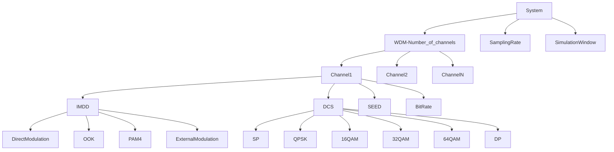
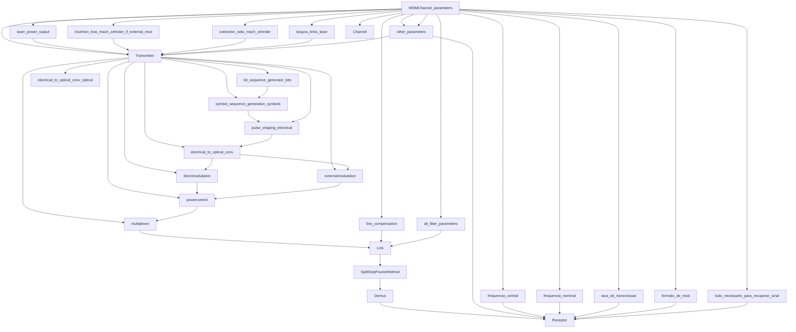

# Second Class Notes

Sinais diferentes para diferentes representações (múltiplas representações numéricas do mesmo sinal).

**Modulações:** 4QAM, QPSK, 16QAM, 32QAM, 64QAM.

A variável `simulation_window` (janela de simulação) é necessária pois, se definirmos um número total de símbolos simulados, o `bitrate` dos canais pode ser diferente, o que atrapalha essa configuração. `simulation_window` é o tempo total de simulação, e o `time_step` é derivado da `sampling_rate`. Se houver conflito entre `bitrate` e `sampling_rate` (o que causa aliasing), será necessário verificar que a `sampling_rate` seja suficiente para atender ao critério de Nyquist dos canais usando o `bitrate`.

A partir disso, criar o transmissor, que define quantos bits serão gerados (por isso precisamos das configurações globais). O diagrama está a seguir:

O `WDMChannel_parameters` serve para TX, Channel e RX através dos parâmetros definidos no primeiro diagrama.

O `Link` precisa definir se é SP (Single Polarization) ou DP (Dual Polarization). Observação: o PMD (Polarization Mode Dispersion) não está implementado, e a rotação de polarização não está correta (abrange apenas um hemisfério da esfera de Poincaré). O diagrama não explicita essas condicionais (tem um "if" escrito em algum local no código).

Considerar tudo como processos (dispositivo é um processo, algo é um processo, talvez verificar como `dataclass` pode organizar isso).

Assumir que o sistema é coerente e trabalhar com IMDD.